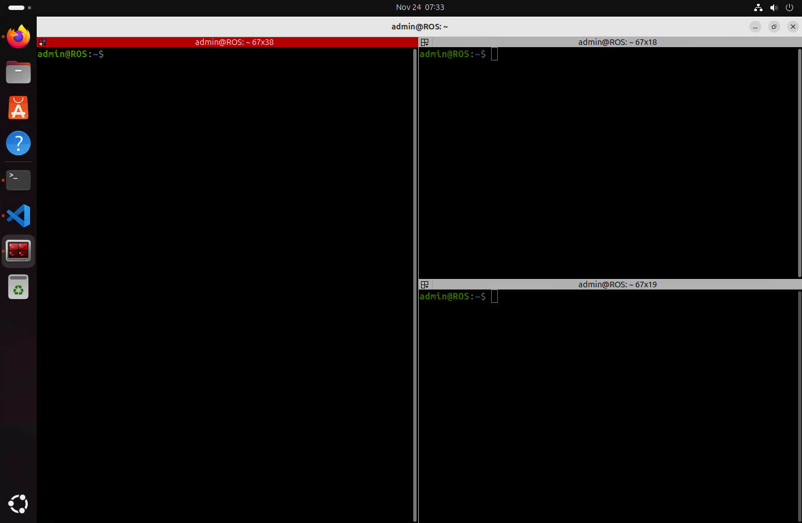
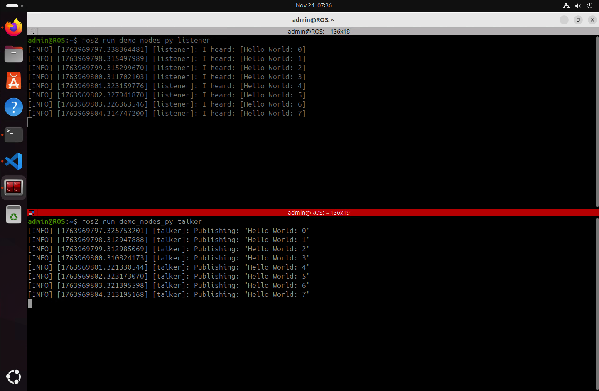

# **ROS2 Jazzy Jalisco / Ubuntu 24.04**

## **📌 Project Title**

ROS2 Jazzy Jalisco on Ubuntu 24.04

## **👤 Authors**

- [@alfaXphoori](https://www.github.com/alfaXphoori)

## **📋 Overview**

This guide provides complete step-by-step instructions to:
- Set up a ROS 2 development environment on Ubuntu 24.04
- Install ROS 2 Jazzy Jalisco with all required tools
- Configure essential development tools (VS Code, Terminator)
- Create and run your first ROS 2 package

---

## **✅ Prerequisites**

- A computer with VirtualBox installed
- At least 50 GB free disk space for VM
- Ubuntu 24.04 LTS ISO image
- 8GB+ RAM recommended for VM

---

## **🛠 Environment Setup**

ROS 2 will be installed on a **Virtual Machine** using:

- **VirtualBox** ([⬇️ Link](https://www.virtualbox.org/wiki/Downloads))
- **Ubuntu 24.04 LTS** ([⬇️ Link](https://ubuntu.com/download/desktop))

### **VirtualBox Configuration**

1. **Create a New Virtual Machine**

   Open VirtualBox and click on **New** to create a new virtual machine.
   

2. **Configure Virtual Machine Name and OS**

   - Set the VM Name (e.g., `ROS`)
   - Select the Ubuntu ISO image
   - Choose OS: Linux, Distribution: Ubuntu (64-bit)
   - Check "Proceed with Unattended Installation"

   

3. **Set Up Unattended Installation**

   - User Name: `admin`
   - Password: Set your password
   - Hostname: `ROS`
   - Domain Name: `myguest.virtualbox.org`
   - Install Guest Additions (recommended)

   

4. **Specify Virtual Hardware**

   - Base Memory: 8192 MB (recommended)
   - Number of CPUs: 10 (adjust based on your system)
   - Enable EFI (optional)

   

5. **Specify Virtual Hard Disk**

   - Create a New Virtual Hard Disk
   - Disk Size: 50 GB (recommended minimum)
   - Hard Disk File Type: VDI (VirtualBox Disk Image)

   

6. **Finish and Start**

   Click **Finish** to create the virtual machine, then click **Start** to begin the Ubuntu installation.

---

## **🚀 ROS 2 Installation**

### **Step 1: Install ROS 2 Jazzy**

Follow the official installation guide:
[ROS 2 Jazzy Installation](https://docs.ros.org/en/jazzy/Installation/Ubuntu-Install-Debs.html)

To locate `.bashrc`, use:

```bash
ls -a
```


Open `.bashrc` with Nano:

```bash
nano ~/.bashrc
```

Append this line to the end of the file:

```bash
source /opt/ros/jazzy/setup.bash
```

Reload the terminal and verify the installation:

```bash
ros2
```

**✅ Congratulations! ROS 2 has been successfully installed.**


---

## **🛠 Install Colcon (ROS 2 Build System)**

1. Verify ROS 2 installation:

   ```bash
   source /opt/ros/jazzy/setup.bash
   ```

2. Install Colcon:

   ```bash
   sudo apt install python3-colcon-common-extensions
   ```

   

3. Verify installation:

   ```bash
   cd /usr/share/colcon_argcomplete/hook/ && ls
   ```

4. Update `.bashrc` with:

   ```bash
   nano ~/.bashrc
   ```

   Add these lines at the end:

   ```bash
   source /opt/ros/jazzy/setup.bash
   source /usr/share/colcon_argcomplete/hook/colcon-argcomplete.bash
   source ~/ros2_ws/install/setup.bash
   ```

   


---

## **🖥 Install Visual Studio Code (VS Code)**

Install **VS Code** on Ubuntu for easier development.

### **Installation Methods**

```bash
sudo snap install --classic code
```

Launch VS Code:

```bash
code
```

### **Recommended Extensions (Microsoft)**

- C/C++
- C/C++ Extension Pack
- Python
- CMake
- CMake Tools
- XML
- XML Tools
- Robot Developer Extensions for ROS 2


---

## **📟 Install Terminator (Advanced Terminal Emulator)**

Install **Terminator** for better terminal management with split panes:

```bash
sudo apt update
sudo apt install terminator
```

Launch Terminator:

```bash
terminator
```



---

## **💻 Essential Development Tools**

Install commonly used development tools and utilities:

```bash
sudo apt update
sudo apt install build-essential git curl wget vim
```

### **Install Python3-PIP for Package Building**

```bash
sudo apt install python3-pip
```

---

## **🎯 Demo Run: ROS 2 Talker & Listener**

Run a simple talker-listener test.

### **Start a Listener Node**

```bash
ros2 run demo_nodes_py listener
```

### **Start a Talker Node** (In a new terminal)

```bash
ros2 run demo_nodes_py talker
```

### **Monitor ROS 2 Topics**

```bash
rqt_graph
ros2 topic list
ros2 topic info /chatter
ros2 topic info /chatter --verbose
```




---

## **🎯 Key Concepts**

### **ROS 2 Ecosystem**
- **ROS 2 (Robot Operating System 2)** - Middleware framework for robotics
- **Jazzy Jalisco** - Latest LTS release with long-term support
- **Ubuntu 24.04 LTS** - Stable, supported base operating system
- **Colcon** - Build tool for ROS 2 packages
- **rclpy** - Python client library for ROS 2

### **Important Directories**
- `~/ros2_ws/` - ROS 2 workspace (user packages here)
- `~/ros2_ws/src/` - Source code directory
- `/opt/ros/jazzy/` - ROS 2 installation directory
- `~/.bashrc` - Shell configuration file

### **Core Concepts**
- **Nodes** - Individual programs/processes in ROS 2
- **Topics** - Communication channels for data
- **Services** - Request-reply communication
- **Actions** - Long-running task communication
- **Messages** - Data structures for communication

---

## **📊 ROS 2 Architecture**

```
┌─────────────────────────────────┐
│    ROS 2 Middleware (DDS)       │
├─────────────────────────────────┤
│  Node 1    │  Node 2  │ Node 3  │
│ (Pub/Sub)  │(Service) │(Action) │
├─────────────────────────────────┤
│   Topics, Services, Actions     │
├─────────────────────────────────┤
│  Hardware Drivers & Libraries   │
└─────────────────────────────────┘
```

---

1. Create a workspace and build it:

   ```bash
   mkdir -p ~/ros2_ws/src
   cd ~/ros2_ws
   colcon build
   ```

   

2. Create a new package named `ce_robot`:

   ```bash
   cd src
   ros2 pkg create ce_robot --build-type ament_python --dependencies rclpy
   ```

   

3. Navigate to the package directory:

   ```bash
   cd ce_robot/ce_robot
   ```

4. Create a Python node and make it executable:

   ```bash
   touch first_node.py
   chmod +x first_node.py
   ```

   

5. Write the Python code for the node, then run it:

   ```bash
   cd ~/ros2_ws
   code .
   ```

   

6. Modify `package.xml` and `setup.py` to include the node:
   - In `setup.py`, under `console_scripts`:

     ```bash
     'first_node = ce_robot.first_node:main',
     ```

   

7. Build the package:

   ```bash
   cd ~/ros2_ws
   colcon build
   ```

8. Run the ROS 2 node:

   ```bash
   source ~/.bashrc
   ros2 run ce_robot first_node
   ```

   

**✅ You have successfully created and executed your first ROS 2 package!**

---

## **📂 Directory Structure**

```
📁 ROS2_WS/
├── 📁 .vscode/
├── 📁 build/
├── 📁 install/
├── 📁 log/
└── 📁 src/
    ├── 📁 .vscode/
    └── 📁 ce_robot/
        ├── 📁 ce_robot/
        │   ├── 📄 __init__.py
        │   └── 🐍 first_node.py
        ├── 📁 resource/
        │   └── 📄 ce_robot
        ├── 📁 test/
        ├── 📄 package.xml
        ├── 📄 setup.cfg
        ├── 📄 setup.py
```

---

## **🚀 Next Steps**

After completing the installation, explore these topics:

1. **Publisher & Subscriber** - Send and receive data between nodes
2. **Services & Clients** - Request-reply communication pattern
3. **Custom Messages** - Define your own data structures
4. **Launch Files** - Automate running multiple nodes
5. **Parameters** - Dynamic configuration management

---

## **⚠️ Troubleshooting**

### **Issue: Command `ros2` not found**
**Solution:**
```bash
source /opt/ros/jazzy/setup.bash
```

### **Issue: Colcon build fails**
**Solution:**
```bash
cd ~/ros2_ws
rm -rf build install log
colcon build
```

### **Issue: Permission denied on .py files**
**Solution:**
```bash
chmod +x ~/ros2_ws/src/ce_robot/ce_robot/*.py
```

### **Issue: Python package not found**
**Solution:**
```bash
pip3 install rclpy
```

---

## **📚 Resources**

- [ROS 2 Official Documentation](https://docs.ros.org/)
- [ROS 2 Jazzy Tutorials](https://docs.ros.org/en/jazzy/Tutorials.html)
- [ROS 2 Community Forum](https://discourse.ros.org/)
- [ROS 2 GitHub Repository](https://github.com/ros2)

---

## **✅ Verification Checklist**

- [ ] Ubuntu 24.04 LTS installed on VM
- [ ] ROS 2 Jazzy installed successfully
- [ ] `.bashrc` configured with ROS 2 sourcing
- [ ] Colcon build system installed
- [ ] VS Code with ROS extensions installed
- [ ] Terminator terminal emulator installed
- [ ] First ROS 2 node created and executed
- [ ] Demo talker-listener test completed
- [ ] rqt_graph visualization working

---

**✅ Installation Complete! Ready for ROS 2 Development!** 🚀✨
