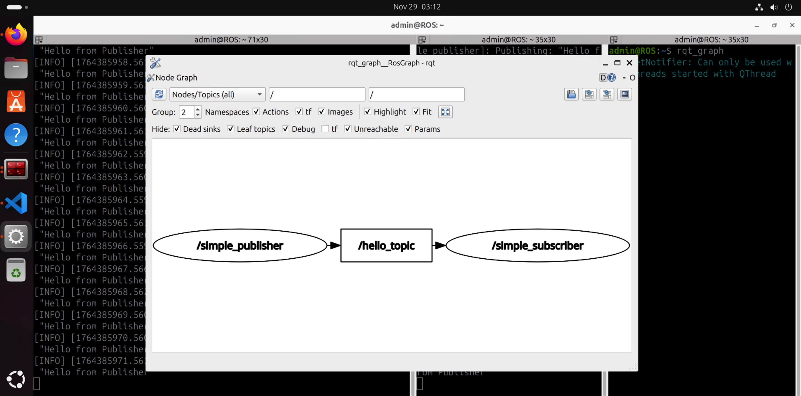
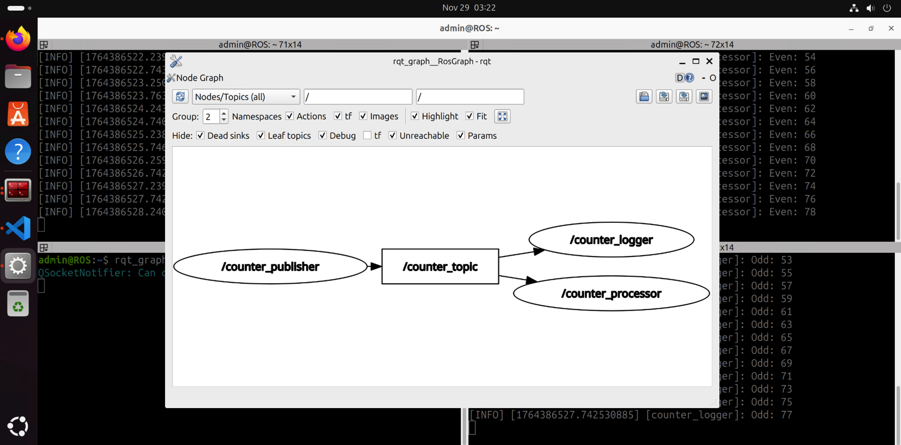
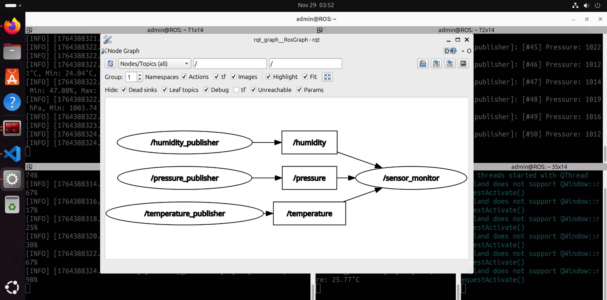

# **📡 ROS 2 Publisher & Subscriber Lab Exercises**

Master topic-based asynchronous communication in ROS 2 through progressive hands-on exercises.

---

## **📌 Project Title**

Create and Use Publisher & Subscriber Nodes in ROS 2

## **👤 Authors**

- [@alfaXphoori](https://www.github.com/alfaXphoori)

---

## **🛠 Lab Overview**

This lab provides hands-on exercises to master Publisher & Subscriber patterns in ROS 2. Each exercise builds upon the previous one, progressing from basic to advanced concepts.

**Duration:** 2-3 hours
**Level:** Beginner to Intermediate
**Prerequisites:** ROS 2 Jazzy installed and first_node completed

---

## **🎯 Learning Objectives**

By completing this lab, you will be able to:

- ✅ Create basic Publisher nodes
- ✅ Create basic Subscriber nodes
- ✅ Understand topic-based asynchronous communication
- ✅ Work with different message types (String, Int32, Float32)
- ✅ Implement timer-based periodic publishing
- ✅ Implement callback-based message processing
- ✅ Debug and monitor topics with ROS 2 tools
- ✅ Implement advanced pub/sub patterns
- ✅ Handle multiple publishers and subscribers
- ✅ Aggregate data from multiple topics

---

## **📊 Lab Architecture**

```
┌─────────────────────────────────────────────┐
│ Exercise 1: Basic Publisher                 │
│ (Create simple string publisher)            │
└──────────────┬──────────────────────────────┘
               │
               ▼
┌─────────────────────────────────────────────┐
│ Exercise 2: Basic Subscriber                │
│ (Create simple subscriber with timestamp)   │
└──────────────┬──────────────────────────────┘
               │
               ▼
┌─────────────────────────────────────────────┐
│ Exercise 3: Counter Publisher               │
│ (Publish incrementing integer counter)      │
└──────────────┬──────────────────────────────┘
               │
               ▼
┌─────────────────────────────────────────────┐
│ Exercise 4: Multiple Subscribers            │
│ (Multiple filters on same topic)            │
└──────────────┬──────────────────────────────┘
               │
               ▼
┌─────────────────────────────────────────────┐
│ Exercise 5: Temperature Simulation          │
│ (Float32 with random variation)             │
└──────────────┬──────────────────────────────┘
               │
               ▼
┌─────────────────────────────────────────────┐
│ Exercise 6: Data Aggregation                │
│ (Multi-topic statistics collection)         │
└─────────────────────────────────────────────┘
```

---

## **📚 Learning Path Overview**

| Exercise | Title | Level | Duration |
|----------|-------|-------|----------|
| 1 | Basic Publisher | Beginner | 20 min |
| 2 | Basic Subscriber | Beginner | 20 min |
| 3 | Counter Publisher | Beginner | 15 min |
| 4 | Multiple Subscribers | Beginner | 20 min |
| 5 | Temperature Simulation | Intermediate | 25 min |
| 6 | Data Aggregation | Intermediate | 30 min |

---

## **Exercise 1: Basic Publisher 📤**

## **Exercise 1: Basic Publisher (Beginner) 📤**

**Objective:** Create a simple publisher that sends string messages

**Tasks:**
1. Navigate to your ce_robot package
2. Create `simple_publisher.py`
3. Implement a publisher that sends "Hello from Publisher" every 1 second
4. Run and verify output

### **📁 File Location**

Navigate to your ROS 2 workspace and create the Python file:

```bash
cd ~/ros2_ws/src/ce_robot/ce_robot
touch simple_publisher.py
chmod +x simple_publisher.py
```

**Directory Structure:**
```
📁 ros2_ws/
└── 📁 src/
    └── 📁 ce_robot/
        └── 📁 ce_robot/
            ├── 📄 __init__.py
            └── 🐍 simple_publisher.py    ← Create this file
```

**File: simple_publisher.py**

```python
#!/usr/bin/env python3
"""
Exercise 1: Basic Publisher
Sends "Hello from Publisher" message every 1 second
"""

import rclpy
from rclpy.node import Node
from std_msgs.msg import String


class SimplePublisher(Node):
    def __init__(self):
        super().__init__('simple_publisher')
        # Create publisher with String message type
        # Topic name: 'hello_topic'
        # Queue size: 10
        self.pub = self.create_publisher(String, 'hello_topic', 10)
        
        # Create timer to publish every 1 second
        self.timer = self.create_timer(1.0, self.timer_callback)
        self.get_logger().info('Simple Publisher started')

    def timer_callback(self):
        # Create message
        msg = String()
        msg.data = "Hello from Publisher"
        
        # Publish message
        self.pub.publish(msg)
        
        # Log the published message
        self.get_logger().info(f'Publishing: "{msg.data}"')


def main(args=None):
    rclpy.init(args=args)
    node = SimplePublisher()
    
    try:
        rclpy.spin(node)
    except KeyboardInterrupt:
        pass
    finally:
        node.destroy_node()
        rclpy.shutdown()


if __name__ == '__main__':
    main()
```

**Expected Output:**

```
[INFO] [simple_publisher]: Simple Publisher started
[INFO] [simple_publisher]: Publishing: "Hello from Publisher"
[INFO] [simple_publisher]: Publishing: "Hello from Publisher"
[INFO] [simple_publisher]: Publishing: "Hello from Publisher"
...
```

**Key Concepts:**
- `create_publisher()` - Creates a publisher on a topic
- `create_timer()` - Calls a callback function at regular intervals
- `publish()` - Sends the message to subscribers
- Queue size (10) - Maximum messages to keep in queue

**Exercise 1 Screenshot:**




---

## **Exercise 2: Basic Subscriber (Beginner) 📥**

**Objective:** Create a simple subscriber that listens to messages with timestamps

**Tasks:**
1. Create `simple_subscriber.py`
2. Subscribe to the topic from Exercise 1
3. Print received messages with a timestamp

**File: simple_subscriber.py**

```python
#!/usr/bin/env python3
"""
Exercise 2: Basic Subscriber
Listens to messages from simple_publisher and prints them with timestamp
"""

import rclpy
from rclpy.node import Node
from std_msgs.msg import String
from datetime import datetime


class SimpleSubscriber(Node):
    def __init__(self):
        super().__init__('simple_subscriber')
        # Subscribe to the same topic as the publisher
        self.sub = self.create_subscription(
            String,              # Message type
            'hello_topic',       # Topic name
            self.callback,       # Callback function
            10                   # Queue size
        )
        self.get_logger().info('Simple Subscriber started - waiting for messages...')

    def callback(self, msg):
        # Get current time
        timestamp = datetime.now().strftime('%H:%M:%S')
        
        # Log received message with timestamp
        self.get_logger().info(f'[{timestamp}] Received: "{msg.data}"')


def main(args=None):
    rclpy.init(args=args)
    node = SimpleSubscriber()
    
    try:
        rclpy.spin(node)
    except KeyboardInterrupt:
        pass
    finally:
        node.destroy_node()
        rclpy.shutdown()


if __name__ == '__main__':
    main()
```

**Expected Output (Publisher):**

```
[INFO] [simple_publisher]: Simple Publisher started
[INFO] [simple_publisher]: Publishing: "Hello from Publisher"
[INFO] [simple_publisher]: Publishing: "Hello from Publisher"
...
```

**Expected Output (Subscriber):**

```
[INFO] [simple_subscriber]: Simple Subscriber started - waiting for messages...
[INFO] [simple_subscriber]: [14:23:45] Received: "Hello from Publisher"
[INFO] [simple_subscriber]: [14:23:46] Received: "Hello from Publisher"
[INFO] [simple_subscriber]: [14:23:47] Received: "Hello from Publisher"
...
```

**Key Concepts:**
- `create_subscription()` - Subscribes to a topic
- Callback function - Executed when message arrives
- Topic matching - Publisher and subscriber must use same topic name

**Exercise 2 Screenshot:**


---

## **Exercise 3: Counter Publisher (Beginner) 🔢**

**Objective:** Create a publisher that sends incrementing counter values (0-100)

**Tasks:**
1. Create `counter_publisher.py`
2. Publish integer counter that increments every 500ms
3. Stop after reaching 100

**File: counter_publisher.py**

```python
#!/usr/bin/env python3
"""
Exercise 3: Counter Publisher
Publishes incrementing counter from 0 to 100 every 500ms
"""

import rclpy
from rclpy.node import Node
from std_msgs.msg import Int32


class CounterPublisher(Node):
    def __init__(self):
        super().__init__('counter_publisher')
        # Create publisher with Int32 message type
        self.pub = self.create_publisher(Int32, 'counter_topic', 10)
        
        # Create timer to publish every 500ms (0.5 seconds)
        self.timer = self.create_timer(0.5, self.timer_callback)
        
        # Initialize counter
        self.counter = 0
        self.get_logger().info('Counter Publisher started')

    def timer_callback(self):
        # Create Int32 message
        msg = Int32()
        msg.data = self.counter
        
        # Publish message
        self.pub.publish(msg)
        
        # Log counter value
        self.get_logger().info(f'Counter: {self.counter}')
        
        # Increment counter
        self.counter += 1
        
        # Stop after reaching 100
        if self.counter > 100:
            self.get_logger().info('Finished! Counter reached 100')
            exit()


def main(args=None):
    rclpy.init(args=args)
    node = CounterPublisher()
    
    try:
        rclpy.spin(node)
    except KeyboardInterrupt:
        pass
    finally:
        node.destroy_node()
        rclpy.shutdown()


if __name__ == '__main__':
    main()
```

**Expected Output:**

```
[INFO] [counter_publisher]: Counter Publisher started
[INFO] [counter_publisher]: Counter: 0
[INFO] [counter_publisher]: Counter: 1
[INFO] [counter_publisher]: Counter: 2
[INFO] [counter_publisher]: Counter: 3
...
[INFO] [counter_publisher]: Counter: 99
[INFO] [counter_publisher]: Counter: 100
[INFO] [counter_publisher]: Finished! Counter reached 100
```

**Key Concepts:**
- Int32 message type for integer data
- Timer interval of 0.5 seconds
- Loop control and exit condition

**Exercise 3 Screenshot:**




---

## **Exercise 4: Multiple Subscribers (Intermediate) 🔀**

**Objective:** Create two different subscribers that filter counter data

**Tasks:**
1. Create `counter_processor.py` - filters even numbers
2. Create `counter_logger.py` - logs odd numbers
3. Run both with the counter_publisher from Exercise 3
4. Verify both receive data correctly

**File 1: counter_processor.py (filters even numbers)**

```python
#!/usr/bin/env python3
"""
Exercise 4a: Counter Processor
Subscribes to counter and only processes even numbers
"""

import rclpy
from rclpy.node import Node
from std_msgs.msg import Int32


class CounterProcessor(Node):
    def __init__(self):
        super().__init__('counter_processor')
        # Subscribe to counter topic
        self.sub = self.create_subscription(
            Int32,
            'counter_topic',
            self.callback,
            10
        )
        self.get_logger().info('Counter Processor started - filtering even numbers')

    def callback(self, msg):
        # Check if number is even
        if msg.data % 2 == 0:
            self.get_logger().info(f'Even: {msg.data}')


def main(args=None):
    rclpy.init(args=args)
    node = CounterProcessor()
    
    try:
        rclpy.spin(node)
    except KeyboardInterrupt:
        pass
    finally:
        node.destroy_node()
        rclpy.shutdown()


if __name__ == '__main__':
    main()
```

**File 2: counter_logger.py (filters odd numbers)**

```python
#!/usr/bin/env python3
"""
Exercise 4b: Counter Logger
Subscribes to counter and only processes odd numbers
"""

import rclpy
from rclpy.node import Node
from std_msgs.msg import Int32


class CounterLogger(Node):
    def __init__(self):
        super().__init__('counter_logger')
        # Subscribe to counter topic
        self.sub = self.create_subscription(
            Int32,
            'counter_topic',
            self.callback,
            10
        )
        self.get_logger().info('Counter Logger started - filtering odd numbers')

    def callback(self, msg):
        # Check if number is odd
        if msg.data % 2 != 0:
            self.get_logger().info(f'Odd: {msg.data}')


def main(args=None):
    rclpy.init(args=args)
    node = CounterLogger()
    
    try:
        rclpy.spin(node)
    except KeyboardInterrupt:
        pass
    finally:
        node.destroy_node()
        rclpy.shutdown()


if __name__ == '__main__':
    main()
```

**Expected Output (Counter Processor):**

```
[INFO] [counter_processor]: Counter Processor started - filtering even numbers
[INFO] [counter_processor]: Even: 0
[INFO] [counter_processor]: Even: 2
[INFO] [counter_processor]: Even: 4
[INFO] [counter_processor]: Even: 6
...
[INFO] [counter_processor]: Even: 98
[INFO] [counter_processor]: Even: 100
```

**Expected Output (Counter Logger):**

```
[INFO] [counter_logger]: Counter Logger started - filtering odd numbers
[INFO] [counter_logger]: Odd: 1
[INFO] [counter_logger]: Odd: 3
[INFO] [counter_logger]: Odd: 5
[INFO] [counter_logger]: Odd: 7
...
[INFO] [counter_logger]: Odd: 97
[INFO] [counter_logger]: Odd: 99
```

**Key Concepts:**
- Multiple subscribers on same topic
- Each subscriber processes independently
- Data filtering logic in callbacks
- Decoupled architecture

**Exercise 4 Screenshot:**


---

## **Exercise 5: Temperature Sensor Simulation (Intermediate) 🌡️**

**Objective:** Simulate a temperature sensor with realistic data and random variation

**Tasks:**
1. Create `temperature_publisher.py`
2. Simulate temperature data with slight random variation
3. Publish every 2 seconds
4. Range: 20-30°C
5. Create `temperature_subscriber.py` to view data
6. Track min/max temperatures received

**File: temperature_publisher.py**

```python
#!/usr/bin/env python3
"""
Exercise 5: Temperature Sensor Simulation
Publishes simulated temperature data with random variation
Temperature range: 20-30°C
Publish rate: Every 2 seconds
"""

import rclpy
from rclpy.node import Node
from std_msgs.msg import Float32
import random


class TemperaturePublisher(Node):
    def __init__(self):
        super().__init__('temperature_publisher')
        # Create publisher with Float32 message type
        self.pub = self.create_publisher(Float32, 'temperature', 10)
        
        # Create timer to publish every 2 seconds
        self.timer = self.create_timer(2.0, self.timer_callback)
        
        # Base temperature (center point)
        self.base_temp = 25.0
        
        # Counter for display
        self.count = 0
        
        self.get_logger().info('Temperature Publisher started')
        self.get_logger().info('Publishing temperature data every 2 seconds...')

    def timer_callback(self):
        # Generate temperature with random variation
        # Range: base_temp ± 1°C = 24-26°C around base
        # Overall range: 20-30°C
        temperature = self.base_temp + random.uniform(-1, 1)
        
        # Clamp temperature to valid range
        temperature = max(20.0, min(30.0, temperature))
        
        # Create Float32 message
        msg = Float32()
        msg.data = temperature
        
        # Publish message
        self.pub.publish(msg)
        
        # Log with formatted output
        self.count += 1
        self.get_logger().info(
            f'[#{self.count}] Temperature: {temperature:.2f}°C'
        )


def main(args=None):
    rclpy.init(args=args)
    node = TemperaturePublisher()
    
    try:
        rclpy.spin(node)
    except KeyboardInterrupt:
        pass
    finally:
        node.destroy_node()
        rclpy.shutdown()


if __name__ == '__main__':
    main()
```

**File: temperature_subscriber.py (to view the data)**

```python
#!/usr/bin/env python3
"""
Temperature Subscriber - View published temperature data
"""

import rclpy
from rclpy.node import Node
from std_msgs.msg import Float32


class TemperatureSubscriber(Node):
    def __init__(self):
        super().__init__('temperature_subscriber')
        # Subscribe to temperature topic
        self.sub = self.create_subscription(
            Float32,
            'temperature',
            self.callback,
            10
        )
        self.min_temp = 30.0
        self.max_temp = 20.0
        self.count = 0
        self.get_logger().info('Temperature Subscriber started')

    def callback(self, msg):
        temp = msg.data
        self.count += 1
        
        # Track min and max
        if temp < self.min_temp:
            self.min_temp = temp
        if temp > self.max_temp:
            self.max_temp = temp
        
        # Display temperature
        self.get_logger().info(
            f'Received #{self.count}: {temp:.2f}°C '
            f'(Min: {self.min_temp:.2f}°C, Max: {self.max_temp:.2f}°C)'
        )


def main(args=None):
    rclpy.init(args=args)
    node = TemperatureSubscriber()
    
    try:
        rclpy.spin(node)
    except KeyboardInterrupt:
        pass
    finally:
        node.destroy_node()
        rclpy.shutdown()


if __name__ == '__main__':
    main()
```

**Expected Output (Publisher):**

```
[INFO] [temperature_publisher]: Temperature Publisher started
[INFO] [temperature_publisher]: Publishing temperature data every 2 seconds...
[INFO] [temperature_publisher]: [#1] Temperature: 24.53°C
[INFO] [temperature_publisher]: [#2] Temperature: 25.12°C
[INFO] [temperature_publisher]: [#3] Temperature: 23.98°C
[INFO] [temperature_publisher]: [#4] Temperature: 26.34°C
[INFO] [temperature_publisher]: [#5] Temperature: 24.67°C
```

**Expected Output (Subscriber):**

```
[INFO] [temperature_subscriber]: Temperature Subscriber started
[INFO] [temperature_subscriber]: Received #1: 24.53°C (Min: 24.53°C, Max: 24.53°C)
[INFO] [temperature_subscriber]: Received #2: 25.12°C (Min: 24.53°C, Max: 25.12°C)
[INFO] [temperature_subscriber]: Received #3: 23.98°C (Min: 23.98°C, Max: 25.12°C)
[INFO] [temperature_subscriber]: Received #4: 26.34°C (Min: 23.98°C, Max: 26.34°C)
[INFO] [temperature_subscriber]: Received #5: 24.67°C (Min: 23.98°C, Max: 26.34°C)
```

**Key Concepts:**
- Float32 message type for decimal numbers
- `random.uniform()` for random variation
- Min/max tracking in subscriber
- Formatted output with `.2f` for 2 decimal places

**Exercise 5 Screenshot:**


---

## **Exercise 6: Data Aggregation (Intermediate) 📊**

**Objective:** Subscribe to multiple topics and aggregate data

**Tasks:**
1. Create `sensor_monitor.py`
2. Subscribe to temperature, humidity, and pressure topics
3. Display average of all three readings every 5 seconds
4. Log statistics (min, max, avg)
5. Create `humidity_publisher.py` and `pressure_publisher.py` to test

**File: sensor_monitor.py**

```python
#!/usr/bin/env python3
"""
Exercise 6: Sensor Monitor - Data Aggregation
Subscribes to temperature, humidity, and pressure topics
Aggregates and displays statistics every 5 seconds
"""

import rclpy
from rclpy.node import Node
from std_msgs.msg import Float32
from collections import deque


class SensorMonitor(Node):
    def __init__(self):
        super().__init__('sensor_monitor')
        
        # Subscribe to three sensor topics
        self.temp_sub = self.create_subscription(
            Float32, 'temperature', self.temp_callback, 10
        )
        self.humidity_sub = self.create_subscription(
            Float32, 'humidity', self.humidity_callback, 10
        )
        self.pressure_sub = self.create_subscription(
            Float32, 'pressure', self.pressure_callback, 10
        )
        
        # Store latest readings
        self.latest_temp = 0.0
        self.latest_humidity = 0.0
        self.latest_pressure = 0.0
        
        # Keep history for statistics
        self.temp_history = deque(maxlen=10)
        self.humidity_history = deque(maxlen=10)
        self.pressure_history = deque(maxlen=10)
        
        # Timer to display statistics every 5 seconds
        self.timer = self.create_timer(5.0, self.display_stats)
        
        self.get_logger().info('Sensor Monitor started')

    def temp_callback(self, msg):
        self.latest_temp = msg.data
        self.temp_history.append(msg.data)
        self.get_logger().info(f'Temperature: {msg.data:.2f}°C')

    def humidity_callback(self, msg):
        self.latest_humidity = msg.data
        self.humidity_history.append(msg.data)
        self.get_logger().info(f'Humidity: {msg.data:.2f}%')

    def pressure_callback(self, msg):
        self.latest_pressure = msg.data
        self.pressure_history.append(msg.data)
        self.get_logger().info(f'Pressure: {msg.data:.2f} hPa')

    def display_stats(self):
        # Calculate statistics for each sensor
        if self.temp_history:
            temp_avg = sum(self.temp_history) / len(self.temp_history)
            temp_min = min(self.temp_history)
            temp_max = max(self.temp_history)
            self.get_logger().info(
                f'Temperature - Avg: {temp_avg:.2f}°C, '
                f'Min: {temp_min:.2f}°C, Max: {temp_max:.2f}°C'
            )

        if self.humidity_history:
            humid_avg = sum(self.humidity_history) / len(self.humidity_history)
            humid_min = min(self.humidity_history)
            humid_max = max(self.humidity_history)
            self.get_logger().info(
                f'Humidity - Avg: {humid_avg:.2f}%, '
                f'Min: {humid_min:.2f}%, Max: {humid_max:.2f}%'
            )

        if self.pressure_history:
            press_avg = sum(self.pressure_history) / len(self.pressure_history)
            press_min = min(self.pressure_history)
            press_max = max(self.pressure_history)
            self.get_logger().info(
                f'Pressure - Avg: {press_avg:.2f} hPa, '
                f'Min: {press_min:.2f} hPa, Max: {press_max:.2f} hPa'
            )

        # Display overall statistics
        if self.temp_history and self.humidity_history and self.pressure_history:
            overall_avg = (
                (sum(self.temp_history) / len(self.temp_history)) +
                (sum(self.humidity_history) / len(self.humidity_history)) +
                (sum(self.pressure_history) / len(self.pressure_history))
            ) / 3
            self.get_logger().info(f'Overall Average: {overall_avg:.2f}')


def main(args=None):
    rclpy.init(args=args)
    node = SensorMonitor()
    
    try:
        rclpy.spin(node)
    except KeyboardInterrupt:
        pass
    finally:
        node.destroy_node()
        rclpy.shutdown()


if __name__ == '__main__':
    main()
```

**Test Publisher Files:**

Create these publishers to test the sensor monitor:

**File: humidity_publisher.py**

```python
#!/usr/bin/env python3
import rclpy
from rclpy.node import Node
from std_msgs.msg import Float32
import random

class HumidityPublisher(Node):
    def __init__(self):
        super().__init__('humidity_publisher')
        self.pub = self.create_publisher(Float32, 'humidity', 10)
        self.timer = self.create_timer(2.0, self.timer_callback)
        self.base_humid = 50.0
        self.count = 0

    def timer_callback(self):
        humidity = self.base_humid + random.uniform(-5, 5)
        humidity = max(30.0, min(80.0, humidity))
        msg = Float32()
        msg.data = humidity
        self.pub.publish(msg)
        self.count += 1
        self.get_logger().info(f'[#{self.count}] Humidity: {humidity:.2f}%')

def main(args=None):
    rclpy.init(args=args)
    rclpy.spin(HumidityPublisher())
    rclpy.shutdown()

if __name__ == '__main__':
    main()
```

**File: pressure_publisher.py**

```python
#!/usr/bin/env python3
import rclpy
from rclpy.node import Node
from std_msgs.msg import Float32
import random

class PressurePublisher(Node):
    def __init__(self):
        super().__init__('pressure_publisher')
        self.pub = self.create_publisher(Float32, 'pressure', 10)
        self.timer = self.create_timer(2.0, self.timer_callback)
        self.base_press = 1013.0
        self.count = 0

    def timer_callback(self):
        pressure = self.base_press + random.uniform(-10, 10)
        pressure = max(950.0, min(1050.0, pressure))
        msg = Float32()
        msg.data = pressure
        self.pub.publish(msg)
        self.count += 1
        self.get_logger().info(f'[#{self.count}] Pressure: {pressure:.2f} hPa')

def main(args=None):
    rclpy.init(args=args)
    rclpy.spin(PressurePublisher())
    rclpy.shutdown()

if __name__ == '__main__':
    main()
```

**Expected Output (Sensor Monitor):**

```
[INFO] [sensor_monitor]: Sensor Monitor started
[INFO] [sensor_monitor]: Temperature: 24.53°C
[INFO] [sensor_monitor]: Humidity: 52.34%
[INFO] [sensor_monitor]: Pressure: 1008.45 hPa
[INFO] [sensor_monitor]: Temperature: 25.12°C
[INFO] [sensor_monitor]: Humidity: 48.67%
[INFO] [sensor_monitor]: Pressure: 1015.23 hPa
[INFO] [sensor_monitor]: Temperature - Avg: 24.83°C, Min: 24.53°C, Max: 25.12°C
[INFO] [sensor_monitor]: Humidity - Avg: 50.51%, Min: 48.67%, Max: 52.34%
[INFO] [sensor_monitor]: Pressure - Avg: 1011.84 hPa, Min: 1008.45 hPa, Max: 1015.23 hPa
[INFO] [sensor_monitor]: Overall Average: 666.08
```

**Key Concepts:**
- Multiple subscriptions in one node
- Data aggregation from different sources
- Statistics calculation (min, max, average)
- Using deque for rolling window history
- Timer for periodic updates

**Exercise 6 Screenshot:**




---

**Commands to Practice:**
```bash
# List all active topics
ros2 topic list

# View topic type
ros2 topic type /hello_topic

# Echo messages in real-time
ros2 topic echo /hello_topic

# Get detailed topic info
ros2 topic info /hello_topic --verbose

# Measure bandwidth usage
ros2 topic bw /hello_topic

# Visualize nodes and connections
rqt_graph

# Monitor system nodes
ros2 node list
```

---

## **📂 Final Directory Structure**

```
📁 ROS2_WS/
├── 📁 src/
│   └── 📁 ce_robot/
│       ├── 📁 ce_robot/
│       │   ├── 📄 __init__.py
│       │   ├── 🐍 simple_publisher.py           # Exercise 1
│       │   ├── 🐍 simple_subscriber.py          # Exercise 2
│       │   ├── 🐍 counter_publisher.py          # Exercise 3
│       │   ├── 🐍 counter_processor.py          # Exercise 4
│       │   ├── 🐍 counter_logger.py             # Exercise 4
│       │   ├── 🐍 temperature_publisher.py      # Exercise 5
│       │   ├── 🐍 temperature_subscriber.py     # Exercise 5
│       │   ├── 🐍 sensor_monitor.py             # Exercise 6
│       │   ├── 🐍 humidity_publisher.py         # Exercise 6
│       │   └── 🐍 pressure_publisher.py         # Exercise 6
│       ├── 📄 package.xml
│       ├── 📄 setup.cfg
│       └── 📄 setup.py
└── 📁 install/
```

**Entry Points in setup.py:**

> 💡 **Note:** See [01_Publisher_Subscriber/Readme.md](Readme.md) for complete setup.py with all 45 entry points.

```python
entry_points={
    'console_scripts': [
        # Publisher/Subscriber exercises (this module)
        "01_simple_publisher = ce_robot.simple_publisher:main",
        "01_simple_subscriber = ce_robot.simple_subscriber:main",
        "01_counter_pubslisher = ce_robot.counter_publisher:main",
        "01_counter_processor = ce_robot.counter_processor:main",
        "01_counter_logger = ce_robot.counter_logger:main",
        "01_temperature_publisher = ce_robot.temperature_publisher:main",
        "01_temperature_subsciber = ce_robot.temperature_subscriber:main",
        "01_sensor_monitor = ce_robot.sensor_monitor:main",
        "01_pressure_publisher = ce_robot.pressure_publisher:main",
        "01_humidity_publisher = ce_robot.humidity_publisher:main",
        # ... other entries from previous modules ...
    ],
},
```

---

## **✅ Completion Checklist**

- [ ] Exercise 1: Basic Publisher completed
- [ ] Exercise 2: Basic Subscriber completed
- [ ] Exercise 3: Counter Publisher completed
- [ ] Exercise 4: Multiple Subscribers completed
- [ ] Exercise 5: Temperature Sensor completed
- [ ] Exercise 6: Data Aggregation completed

---

## **💡 Tips & Tricks**

1. **Always source setup.bash before running:**
   ```bash
   source ~/.bashrc
   ```

2. **Use print statements for debugging:**
   ```python
   print(f"Debug: {variable}")
   ```

3. **Monitor topics in real-time:**
   ```bash
   ros2 topic echo /topic_name
   ```

4. **Check node connectivity:**
   ```bash
   rqt_graph
   ```

5. **View all active topics:**
   ```bash
   ros2 topic list
   ```

6. **Get message type info:**
   ```bash
   ros2 interface show std_msgs/msg/String
   ```

---

**🎓 Congratulations! You've completed the ROS 2 Publisher & Subscriber Lab!** 🚀✨
