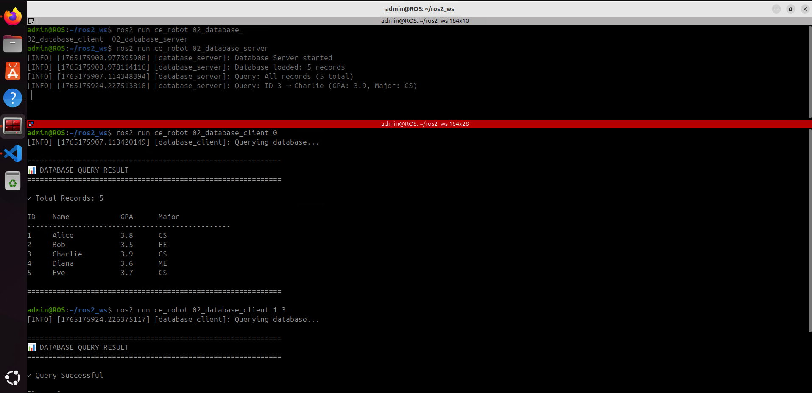

# **🔌 ROS 2 Server & Client Lab Exercises**

Master synchronous request-reply communication patterns in ROS 2 through progressive hands-on exercises.

---

## **📌 Project Title**

Create and Use Server & Client Nodes in ROS 2

## **👤 Authors**

- [@alfaXphoori](https://www.github.com/alfaXphoori)

---

## **🛠 Lab Overview**

This lab provides hands-on exercises to master Service-based (request-reply) communication patterns in ROS 2. Each exercise builds upon the previous one, progressing from basic to advanced concepts.

**Duration:** 2-3 hours
**Level:** Beginner to Intermediate
**Prerequisites:** ROS 2 Jazzy installed, Publisher/Subscriber lab completed

---

## **🎯 Learning Objectives**

By completing this lab, you will be able to:

- ✅ Create basic Server nodes with service handlers
- ✅ Create basic Client nodes that make requests
- ✅ Understand synchronous request-reply communication patterns
- ✅ Work with built-in and custom service types
- ✅ Implement error handling and validation
- ✅ Debug and monitor services with ROS 2 tools
- ✅ Handle multiple services in one node
- ✅ Implement state management across service calls
- ✅ Coordinate multi-service workflows
- ✅ Apply defensive programming practices in services

---

## **📊 Lab Architecture**

```
┌─────────────────────────────────────────────┐
│ Exercise 1: Temperature Conversion          │
│ (Basic service with unit conversion)        │
└──────────────┬──────────────────────────────┘
               │
               ▼
┌─────────────────────────────────────────────┐
│ Exercise 2: Database Query Service          │
│ (Query & filter multiple records)           │
└──────────────┬──────────────────────────────┘
               │
               ▼
┌─────────────────────────────────────────────┐
│ Exercise 3: Multi-Service Robot Controller  │
│ (Coordinate multiple service calls)         │
└─────────────────────────────────────────────┘
```

---

## **📚 Learning Path Overview**

| Exercise | Title | Level | Duration |
|----------|-------|-------|----------|
| 1 | Temperature Conversion Service | Beginner | 25 min |
| 2 | Database Query Service | Intermediate | 30 min |
| 3 | Multi-Service Robot Controller | Advanced | 35 min |

---

## **Exercise 1: Temperature Conversion Service (Beginner) 🌡️**

**Objective:** Create a service that converts temperature between units

**Tasks:**
1. Create `temp_converter_server.py`
2. Implement conversion: Celsius ↔ Fahrenheit ↔ Kelvin
3. Create `temp_converter_client.py` with user input
4. Add input validation for temperature ranges

### **📁 File Location**

Navigate to your ROS 2 workspace and create the Python file:

```bash
cd ~/ros2_ws/src/ce_robot/ce_robot
touch temp_converter_server.py
chmod +x temp_converter_server.py
```

**Directory Structure:**
```
📁 ros2_ws/
└── 📁 src/
    └── 📁 ce_robot/
        └── 📁 ce_robot/
            ├── 📄 __init__.py
            └── 🐍 temp_converter_server.py    ← Create this file
```

**File: temp_converter_server.py**

```python
#!/usr/bin/env python3
"""
Exercise 1: Temperature Conversion Server
Converts temperature between Celsius, Fahrenheit, and Kelvin
- Input °C (flag=1) → Output °F
- Input °F (flag=2) → Output °C
- Input K (flag=3) → Output °C
"""

import rclpy
from rclpy.node import Node
from example_interfaces.srv import AddTwoInts


class TempConverterServer(Node):
    def __init__(self):
        super().__init__('temp_converter_server')
        
        # Create service
        self.srv = self.create_service(
            AddTwoInts,
            'convert_temperature',
            self.convert_callback
        )
        
        self.get_logger().info('Temperature Converter Server started')
        self.get_logger().info('Service: /convert_temperature')
        self.get_logger().info('Conversions:')
        self.get_logger().info('  1: °C → °F (Celsius to Fahrenheit)')
        self.get_logger().info('  2: °F → °C (Fahrenheit to Celsius)')
        self.get_logger().info('  3: K → °C (Kelvin to Celsius)')

    def convert_callback(self, request, response):
        """
        Convert temperature
        request.a = temperature value
        request.b = conversion flag (1=C→F, 2=F→C, 3=K→C)
        response.sum = result
        """
        temp = request.a
        flag = request.b
        
        if flag == 1:  # Celsius to Fahrenheit
            # Formula: F = (C × 9/5) + 32
            result = (temp * 9/5) + 32
            self.get_logger().info(f'Converting {temp}°C → {result:.2f}°F')
            response.sum = int(result)
        
        elif flag == 2:  # Fahrenheit to Celsius
            # Formula: C = (F - 32) × 5/9
            result = (temp - 32) * 5/9
            self.get_logger().info(f'Converting {temp}°F → {result:.2f}°C')
            response.sum = int(result)
        
        elif flag == 3:  # Kelvin to Celsius
            # Formula: C = K - 273.15
            result = temp - 273.15
            self.get_logger().info(f'Converting {temp}K → {result:.2f}°C')
            response.sum = int(result)
        
        else:
            self.get_logger().error(f'Invalid flag: {flag}. Use 1 (C→F), 2 (F→C), or 3 (K→C)')
            response.sum = -999
        
        return response


def main(args=None):
    rclpy.init(args=args)
    node = TempConverterServer()
    
    try:
        rclpy.spin(node)
    except KeyboardInterrupt:
        pass
    finally:
        node.destroy_node()
        rclpy.shutdown()


if __name__ == '__main__':
    main()
```

**File: temp_converter_client.py**

```python
#!/usr/bin/env python3
"""
Exercise 1: Temperature Conversion Client
Usage: ros2 run ce_robot temp_converter_client <temperature> <flag>

Examples:
  ros2 run ce_robot temp_converter_client 100 1  # Convert 100°C to °F
  ros2 run ce_robot temp_converter_client 77 2   # Convert 77°F to °C
  ros2 run ce_robot temp_converter_client 298 3  # Convert 298K to °C

Flags:
  1: Celsius → Fahrenheit (°C → °F)
  2: Fahrenheit → Celsius (°F → °C)
  3: Kelvin → Celsius (K → °C)
"""

import sys
import rclpy
from rclpy.node import Node
from example_interfaces.srv import AddTwoInts


class TempConverterClient(Node):
    def __init__(self):
        super().__init__('temp_converter_client')

    def convert(self, temp, unit):
        """Request temperature conversion"""
        
        client = self.create_client(AddTwoInts, 'convert_temperature')
        
        while not client.wait_for_service(timeout_sec=1.0):
            self.get_logger().info('Service not available, waiting...')
        
        request = AddTwoInts.Request()
        request.a = temp
        request.b = unit
        
        self.get_logger().info(f'Converting {temp}...')
        future = client.call_async(request)
        
        rclpy.spin_until_future_complete(self, future)
        
        return future.result()


def main(args=None):
    rclpy.init(args=args)
    
    # Parse command-line arguments
    if len(sys.argv) < 3:
        print('\n=== Temperature Unit Conversion Client ===\n')
        print('Usage: ros2 run ce_robot temp_converter_client <temperature> <flag>\n')
        print('Examples:')
        print('  ros2 run ce_robot temp_converter_client 100 1  # Convert 100°C to °F')
        print('  ros2 run ce_robot temp_converter_client 77 2   # Convert 77°F to °C')
        print('  ros2 run ce_robot temp_converter_client 298 3  # Convert 298K to °C\n')
        print('Conversion Flags:')
        print('  1: Celsius → Fahrenheit (°C → °F)')
        print('  2: Fahrenheit → Celsius (°F → °C)')
        print('  3: Kelvin → Celsius (K → °C)\n')
        sys.exit(1)
    
    try:
        temperature = float(sys.argv[1])
        unit_flag = int(sys.argv[2])
        
        # Validate flag
        if unit_flag not in [1, 2, 3]:
            print(f'\n❌ Error: Invalid flag "{unit_flag}"')
            print('Use: 1 (C→F), 2 (F→C), or 3 (K→C)\n')
            sys.exit(1)
        
        node = TempConverterClient()
        response = node.convert(int(temperature), unit_flag)
        
        # Display result
        unit_names = {
            1: ('°C', '°F'),
            2: ('°F', '°C'),
            3: ('K', '°C')
        }
        from_unit, to_unit = unit_names[unit_flag]
        print(f'\n✓ Result: {temperature}{from_unit} = {response.sum}{to_unit}\n')
        
        node.destroy_node()
        rclpy.shutdown()
        
    except ValueError as e:
        print(f'\n❌ Error: Invalid input. Please enter valid numbers.\n')
        sys.exit(1)
    except Exception as e:
        print(f'\n❌ Error: {str(e)}\n')
        sys.exit(1)


if __name__ == '__main__':
    main()
```

**Expected Output (Server):**

```
[INFO] [temp_converter_server]: Temperature Converter Server started
[INFO] [temp_converter_server]: Service: /convert_temperature
[INFO] [temp_converter_server]: Conversions:
[INFO] [temp_converter_server]:   1: °C → °F (Celsius to Fahrenheit)
[INFO] [temp_converter_server]:   2: °F → °C (Fahrenheit to Celsius)
[INFO] [temp_converter_server]:   3: K → °C (Kelvin to Celsius)
[INFO] [temp_converter_server]: Converting 100°C → 212.00°F
[INFO] [temp_converter_server]: Converting 77°F → 25.00°C
[INFO] [temp_converter_server]: Converting 298K → 24.85°C
```

**Expected Output (Client):**

```
=== Temperature Unit Conversion Client ===

Usage: ros2 run ce_robot temp_converter_client <temperature> <flag>

Examples:
  ros2 run ce_robot temp_converter_client 100 1  # Convert 100°C to °F
  ros2 run ce_robot temp_converter_client 77 2   # Convert 77°F to °C
  ros2 run ce_robot temp_converter_client 298 3  # Convert 298K to °C

Conversion Flags:
  1: Celsius → Fahrenheit (°C → °F)
  2: Fahrenheit → Celsius (°F → °C)
  3: Kelvin → Celsius (K → °C)

✓ Result: 100°C = 212°F
```

**Result Screenshot:**


**How to Run Exercise 1:**

```bash
# Terminal 1: Start the server
ros2 run ce_robot temp_converter_server

# Terminal 2: Convert 100°C to °F (run once)
ros2 run ce_robot temp_converter_client 100 1

# Terminal 2: For new conversion, run new command
ros2 run ce_robot temp_converter_client 77 2

# Terminal 2: Another conversion
ros2 run ce_robot temp_converter_client 298 3
```

**Key Concepts:**
- Command-line argument parsing for service client
- Single execution per command (no interactive mode)
- Temperature conversion formulas (C↔F, K→C)
- Error validation and handling
- Unit mapping and result display
- Service request/response handling

---

## **Exercise 2: Database Query Service (Intermediate) 🗄️**

**Objective:** Create a service that queries a database of records

**Tasks:**
1. Create `database_server.py` with student records
2. Support query by ID, name, or all records
3. Create `database_client.py` with query options
4. Implement filtering and sorting

**File: database_server.py**

```python
#!/usr/bin/env python3
"""
Exercise 2: Database Query Server
Maintains a student database and handles queries
"""

import rclpy
from rclpy.node import Node
from example_interfaces.srv import AddTwoInts


class DatabaseServer(Node):
    def __init__(self):
        super().__init__('database_server')
        
        # Initialize student database
        self.students = {
            1: {'name': 'Alice', 'gpa': 3.8, 'major': 'CS'},
            2: {'name': 'Bob', 'gpa': 3.5, 'major': 'EE'},
            3: {'name': 'Charlie', 'gpa': 3.9, 'major': 'CS'},
            4: {'name': 'Diana', 'gpa': 3.6, 'major': 'ME'},
            5: {'name': 'Eve', 'gpa': 3.7, 'major': 'CS'},
        }
        
        self.srv = self.create_service(
            AddTwoInts,
            'query_database',
            self.query_callback
        )
        
        self.get_logger().info('Database Server started')
        self.get_logger().info(f'Database loaded: {len(self.students)} records')

    def query_callback(self, request, response):
        """Handle database queries"""
        
        query_type = request.a  # 0=all, 1=by_id
        query_id = request.b
        
        if query_type == 0:  # Get all
            count = len(self.students)
            self.get_logger().info(f'Query: All records ({count} total)')
            response.sum = count
        
        elif query_type == 1:  # Get by ID
            if query_id in self.students:
                student = self.students[query_id]
                self.get_logger().info(
                    f'Query: ID {query_id} → {student["name"]} '
                    f'(GPA: {student["gpa"]}, Major: {student["major"]})'
                )
                response.sum = query_id  # Return success
            else:
                self.get_logger().warn(f'Query: ID {query_id} not found')
                response.sum = -1  # Not found
        
        return response


def main(args=None):
    rclpy.init(args=args)
    node = DatabaseServer()
    
    try:
        rclpy.spin(node)
    except KeyboardInterrupt:
        pass
    finally:
        node.destroy_node()
        rclpy.shutdown()


if __name__ == '__main__':
    main()
```

**File: database_client.py**

```python
#!/usr/bin/env python3
"""
Exercise 2: Database Client
Queries the student database with formatted output
Usage: ros2 run ce_robot database_client <query_type> [id]
query_type: 0=all, 1=by_id

Examples:
  ros2 run ce_robot database_client 0      # Get all records
  ros2 run ce_robot database_client 1 1    # Get student with ID 1
  ros2 run ce_robot database_client 1 3    # Get student with ID 3
"""

import sys
import rclpy
from rclpy.node import Node
from example_interfaces.srv import AddTwoInts


class DatabaseClient(Node):
    def __init__(self):
        super().__init__('database_client')
        
        # Student database for display
        self.students = {
            1: {'name': 'Alice', 'gpa': 3.8, 'major': 'CS'},
            2: {'name': 'Bob', 'gpa': 3.5, 'major': 'EE'},
            3: {'name': 'Charlie', 'gpa': 3.9, 'major': 'CS'},
            4: {'name': 'Diana', 'gpa': 3.6, 'major': 'ME'},
            5: {'name': 'Eve', 'gpa': 3.7, 'major': 'CS'},
        }

    def query(self, query_type, query_id=0):
        """Query the database"""
        
        client = self.create_client(AddTwoInts, 'query_database')
        
        while not client.wait_for_service(timeout_sec=1.0):
            self.get_logger().info('Service not available, waiting...')
        
        request = AddTwoInts.Request()
        request.a = query_type
        request.b = query_id
        
        self.get_logger().info(f'Querying database...')
        future = client.call_async(request)
        
        rclpy.spin_until_future_complete(self, future)
        
        return future.result()


def main(args=None):
    rclpy.init(args=args)
    
    if len(sys.argv) < 2:
        print('\n=== Database Query Client ===\n')
        print('Usage: database_client <query_type> [id]\n')
        print('Query Types:')
        print('  0 = Get all records')
        print('  1 = Get record by ID\n')
        print('Examples:')
        print('  ros2 run ce_robot database_client 0      # Get all records')
        print('  ros2 run ce_robot database_client 1 1    # Get student with ID 1')
        print('  ros2 run ce_robot database_client 1 3    # Get student with ID 3\n')
        sys.exit(1)
    
    try:
        query_type = int(sys.argv[1])
        query_id = int(sys.argv[2]) if len(sys.argv) > 2 else 0
        
        node = DatabaseClient()
        response = node.query(query_type, query_id)
        
        print('\n' + '='*60)
        print('📊 DATABASE QUERY RESULT')
        print('='*60 + '\n')
        
        if query_type == 0:  # Get all records
            if response.sum > 0:
                print(f'✓ Total Records: {response.sum}\n')
                print(f'{"ID":<5} {"Name":<15} {"GPA":<8} {"Major":<10}')
                print('-'*48)
                for sid, student in node.students.items():
                    print(f'{sid:<5} {student["name"]:<15} {student["gpa"]:<8} {student["major"]:<10}')
                print()
            else:
                print('❌ No records found\n')
        
        elif query_type == 1:  # Get by ID
            if response.sum >= 0 and response.sum in node.students:
                student = node.students[response.sum]
                print(f'✓ Query Successful\n')
                print(f'ID:    {response.sum}')
                print(f'Name:  {student["name"]}')
                print(f'GPA:   {student["gpa"]}')
                print(f'Major: {student["major"]}\n')
            else:
                print(f'❌ Student with ID {query_id} not found\n')
        
        else:
            print(f'❌ Invalid query type: {query_type}\n')
        
        print('='*60 + '\n')
        
        node.destroy_node()
        rclpy.shutdown()
        
    except ValueError:
        print(f'\n❌ Error: Invalid input. Please enter valid numbers.\n')
        sys.exit(1)
    except Exception as e:
        print(f'\n❌ Error: {str(e)}\n')
        sys.exit(1)


if __name__ == '__main__':
    main()
```

**Expected Output (Client - Query All):**

```
============================================================
📊 DATABASE QUERY RESULT
============================================================

✓ Total Records: 5

ID    Name            GPA      Major     
────────────────────────────────────────────────
1     Alice           3.8      CS        
2     Bob             3.5      EE        
3     Charlie         3.9      CS        
4     Diana           3.6      ME        
5     Eve             3.7      CS        

============================================================
```

**Expected Output (Client - Query by ID):**

```
============================================================
📊 DATABASE QUERY RESULT
============================================================

✓ Query Successful

ID:    1
Name:  Alice
GPA:   3.8
Major: CS

============================================================
```

**Expected Output (Client - Not Found):**

```
============================================================
📊 DATABASE QUERY RESULT
============================================================

❌ Student with ID 10 not found

============================================================
```

**Result Screenshot:**



**How to Run Exercise 2:**

```bash
# Terminal 1: Start the server
ros2 run ce_robot database_server

# Terminal 2: Get all records
ros2 run ce_robot database_client 0

# Terminal 2: Query specific student by ID
ros2 run ce_robot database_client 1 1

# Terminal 2: Query another student
ros2 run ce_robot database_client 1 3

# Terminal 2: Query non-existent student
ros2 run ce_robot database_client 1 10
```

**Key Concepts:**
- Data structures (dictionaries) for storage
- Query patterns (get all, filter by ID)
- Status codes and error handling
- In-memory database simulation

---

## **Exercise 3: Multi-Service Robot Controller (Intermediate) 🤖**

**Objective:** Create a robot controller with multiple related services

**Tasks:**
1. Create `robot_controller_server.py` with 3 services:
   - Movement (forward, backward, turn)
   - Sensor reading
   - LED control
2. Create `robot_controller_client.py` to coordinate calls
3. Implement state management

**File: robot_controller_server.py**

```python
#!/usr/bin/env python3
"""
Exercise 3: Robot Controller Server
Manages multiple robot control services
"""

import rclpy
from rclpy.node import Node
from example_interfaces.srv import AddTwoInts


class RobotControllerServer(Node):
    def __init__(self):
        super().__init__('robot_controller_server')
        
        # Robot state
        self.position_x = 0.0
        self.position_y = 0.0
        self.heading = 0.0  # degrees
        self.battery = 100  # percentage
        self.led_color = 'off'  # off, red, green, blue
        
        # Create services
        self.move_srv = self.create_service(
            AddTwoInts, 'robot/move', self.move_callback
        )
        self.sensor_srv = self.create_service(
            AddTwoInts, 'robot/sensor', self.sensor_callback
        )
        self.led_srv = self.create_service(
            AddTwoInts, 'robot/led', self.led_callback
        )
        
        self.get_logger().info('Robot Controller Server started')

    def move_callback(self, request, response):
        """Handle movement commands"""
        command = request.a  # 1=forward, 2=backward, 3=turn_left, 4=turn_right
        distance = request.b
        
        if command == 1:  # Forward
            self.position_x += distance
            self.get_logger().info(f'Moving forward {distance}m')
        elif command == 2:  # Backward
            self.position_x -= distance
            self.get_logger().info(f'Moving backward {distance}m')
        elif command == 3:  # Turn left
            self.heading += distance
            self.get_logger().info(f'Turning left {distance}°')
        elif command == 4:  # Turn right
            self.heading -= distance
            self.get_logger().info(f'Turning right {distance}°')
        
        self.battery -= 5  # Battery drain
        response.sum = int(self.battery)
        
        return response

    def sensor_callback(self, request, response):
        """Return sensor data"""
        sensor_type = request.a  # 1=position, 2=battery, 3=heading
        
        if sensor_type == 1:
            response.sum = int(self.position_x)
            self.get_logger().info(f'Position: ({self.position_x:.1f}, {self.position_y:.1f})')
        elif sensor_type == 2:
            response.sum = int(self.battery)
            self.get_logger().info(f'Battery: {self.battery}%')
        elif sensor_type == 3:
            response.sum = int(self.heading)
            self.get_logger().info(f'Heading: {self.heading}°')
        
        return response

    def led_callback(self, request, response):
        """Handle LED control"""
        color_code = request.a  # 0=off, 1=red, 2=green, 3=blue
        colors = {0: 'off', 1: 'red', 2: 'green', 3: 'blue'}
        
        self.led_color = colors.get(color_code, 'off')
        self.get_logger().info(f'LED set to: {self.led_color}')
        response.sum = color_code
        
        return response


def main(args=None):
    rclpy.init(args=args)
    node = RobotControllerServer()
    
    try:
        rclpy.spin(node)
    except KeyboardInterrupt:
        pass
    finally:
        node.destroy_node()
        rclpy.shutdown()


if __name__ == '__main__':
    main()
```

**File: robot_controller_client.py**

```python
#!/usr/bin/env python3
"""
Exercise 3: Robot Controller Client
Coordinates multiple service calls to control robot
"""

import rclpy
from rclpy.node import Node
from example_interfaces.srv import AddTwoInts


class RobotControllerClient(Node):
    def __init__(self):
        super().__init__('robot_controller_client')
        self.move_client = self.create_client(AddTwoInts, 'robot/move')
        self.sensor_client = self.create_client(AddTwoInts, 'robot/sensor')
        self.led_client = self.create_client(AddTwoInts, 'robot/led')

    def move(self, command, distance):
        """Move the robot"""
        while not self.move_client.wait_for_service(timeout_sec=1.0):
            self.get_logger().info('Move service not available...')
        
        request = AddTwoInts.Request()
        request.a = command
        request.b = distance
        
        future = self.move_client.call_async(request)
        rclpy.spin_until_future_complete(self, future)
        
        return future.result()

    def read_sensor(self, sensor_type):
        """Read sensor data"""
        while not self.sensor_client.wait_for_service(timeout_sec=1.0):
            self.get_logger().info('Sensor service not available...')
        
        request = AddTwoInts.Request()
        request.a = sensor_type
        request.b = 0
        
        future = self.sensor_client.call_async(request)
        rclpy.spin_until_future_complete(self, future)
        
        return future.result()

    def set_led(self, color_code):
        """Set LED color"""
        while not self.led_client.wait_for_service(timeout_sec=1.0):
            self.get_logger().info('LED service not available...')
        
        request = AddTwoInts.Request()
        request.a = color_code
        request.b = 0
        
        future = self.led_client.call_async(request)
        rclpy.spin_until_future_complete(self, future)
        
        return future.result()

    def execute_mission(self):
        """Execute a robot mission"""
        self.get_logger().info('Starting robot mission...')
        
        # Set LED to green (starting)
        self.set_led(2)
        
        # Move forward 10 units
        self.move(1, 10)
        
        # Check battery
        battery = self.read_sensor(2)
        self.get_logger().info(f'Battery level: {battery.sum}%')
        
        # Turn left 45 degrees
        self.move(3, 45)
        
        # Move forward 5 units
        self.move(1, 5)
        
        # Check position
        position = self.read_sensor(1)
        self.get_logger().info(f'Position: {position.sum}')
        
        # Set LED to blue (done)
        self.set_led(3)
        
        self.get_logger().info('Mission complete!')


def main(args=None):
    rclpy.init(args=args)
    node = RobotControllerClient()
    
    try:
        node.execute_mission()
    except Exception as e:
        node.get_logger().error(f'Mission failed: {str(e)}')
    finally:
        node.destroy_node()
        rclpy.shutdown()


if __name__ == '__main__':
    main()
```

**Expected Output (Server):**

```
[INFO] [robot_controller_server]: Robot Controller Server started
[INFO] [robot_controller_server]: LED set to: green
[INFO] [robot_controller_server]: Moving forward 10m
[INFO] [robot_controller_server]: Battery: 95%
[INFO] [robot_controller_server]: Turning left 45°
[INFO] [robot_controller_server]: Moving forward 5m
[INFO] [robot_controller_server]: Position: (15.0, 0.0)
[INFO] [robot_controller_server]: LED set to: blue
```

**Expected Output (Client):**

```
[INFO] [robot_controller_client]: Starting robot mission...
[INFO] [robot_controller_client]: Battery level: 95
[INFO] [robot_controller_client]: Position: 15
[INFO] [robot_controller_client]: Mission complete!
```

**Result Screenshot:**


**Key Concepts:**
- Multiple services in one node
- State management across services
- Sequential service calls from client
- Coordinated multi-service workflows
- Battery/resource management

---

## **Commands to Practice**

```bash
# List all active services
ros2 service list

# View service type
ros2 service type /add_numbers

# View service definition
ros2 service find example_interfaces/srv/AddTwoInts

# Call service from command line
ros2 service call /add_numbers example_interfaces/srv/AddTwoInts "{a: 10, b: 20}"

# Monitor service calls (requires separate window)
ros2 service call /add_numbers example_interfaces/srv/AddTwoInts "{a: 5, b: 3}"

# View node graph
rqt_graph

# List all nodes
ros2 node list

# Get node info
ros2 node info /calculator_server
```

---

## **📂 Final Directory Structure**

```
📁 ROS2_WS/
├── 📁 src/
│   └── 📁 ce_robot/
│       ├── 📁 ce_robot/
│       │   ├── 📄 __init__.py
│       │   ├── 🐍 temp_converter_server.py      # Exercise 1
│       │   ├── 🐍 temp_converter_client.py      # Exercise 1
│       │   ├── 🐍 database_server.py            # Exercise 2
│       │   ├── 🐍 database_client.py            # Exercise 2
│       │   ├── 🐍 robot_controller_server.py    # Exercise 3
│       │   └── 🐍 robot_controller_client.py    # Exercise 3
│       ├── 📄 package.xml
│       ├── 📄 setup.cfg
│       └── 📄 setup.py
└── 📁 install/
```

**Entry Points in setup.py:**
```python
entry_points={
    'console_scripts': [
        '02_temp_converter_server = ce_robot.temp_converter_server:main',
        '02_temp_converter_client = ce_robot.temp_converter_client:main',
        '02_database_server = ce_robot.database_server:main',
        '02_database_client = ce_robot.database_client:main',
        '02_robot_controller_server = ce_robot.robot_controller_server:main',
        '02_robot_controller_client = ce_robot.robot_controller_client:main',
    ],
},
```

---

## **✅ Completion Checklist**

- [ ] Exercise 1: Temperature Conversion Service completed
- [ ] Exercise 2: Database Query Service completed
- [ ] Exercise 3: Multi-Service Robot Controller completed
- [ ] All servers start without errors
- [ ] All clients connect and receive responses
- [ ] Command-line service calls work
- [ ] rqt_graph shows proper connections
- [ ] Error handling tested

---

## **💡 Tips & Tricks**

1. **Always check service availability:**
   ```python
   while not client.wait_for_service(timeout_sec=1.0):
       self.get_logger().info('Waiting for service...')
   ```

2. **Use status codes for error handling:**
   ```python
   if response.sum == -1:
       self.get_logger().error('Operation failed')
   ```

3. **List services in real-time:**
   ```bash
   ros2 service list
   ```

4. **Test services from command line:**
   ```bash
   ros2 service call /service_name package/srv/ServiceType "{field: value}"
   ```

5. **Debug service connections:**
   ```bash
   rqt_graph
   ```

6. **Create custom .srv files for better type safety:**
   ```
   # In srv/ folder
   CustomService.srv
   ```

---

**🎓 Congratulations! You've completed the ROS 2 Server & Client Lab!** 🚀✨
