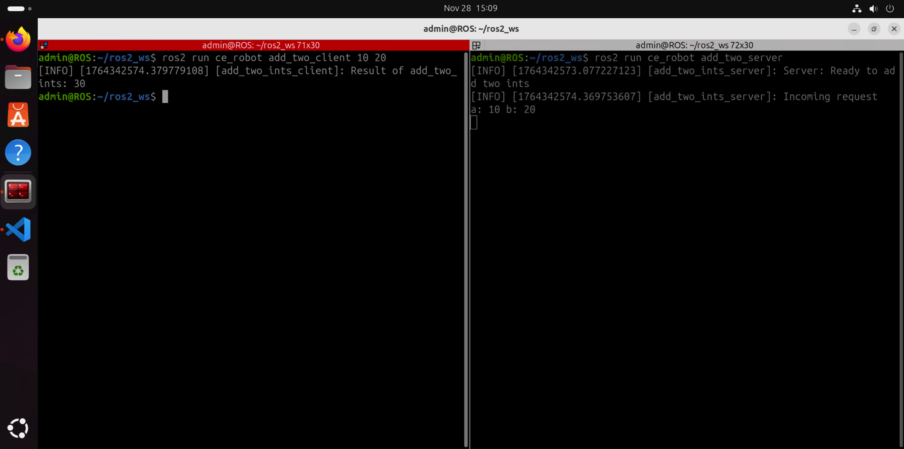

# **ROS2 Server & Client Nodes**

## **📌 Project Title**

Create Server and Client Nodes in ROS 2 for Synchronous Communication

## **👤 Authors**

- [@alfaXphoori](https://www.github.com/alfaXphoori)

## **🛠 Overview**

This guide demonstrates **Service-based communication** in ROS 2:
- **Server Node** - Handles requests and responds with results
- **Client Node** - Sends requests and waits for responses
- Synchronous communication pattern (request-reply)
- Ideal for one-time queries or computations

---

## **📊 Architecture**

```
┌──────────────────┐
│  Client Node     │
│  (Sends Request) │
└────────┬─────────┘
         │
    Request: (a=10, b=20)
         │
         ▼
┌──────────────────┐
│  Server Node     │
│ (Processes &     │
│  Responds)       │
└────────┬─────────┘
         │
    Response: sum=30
         │
         ▼
┌──────────────────┐
│  Client Node     │
│  (Receives)      │
└──────────────────┘
```

---

## **⚙️ Setting Up the Server Node**

Navigate to the `ce_robot` package directory:

```bash
cd ~/ros2_ws/src/ce_robot/ce_robot
```

Create a Python file for the Server:

```bash
touch add_two_ints_server.py
chmod +x add_two_ints_server.py
```

**Directory Structure:**
```
📁 ros2_ws/
└── 📁 src/
    └── 📁 ce_robot/
        └── 📁 ce_robot/
            ├── 📄 __init__.py
            └── 🐍 add_two_ints_server.py    ← Create this file
```

Write the necessary Python code for the server service handler:

```python
#!/usr/bin/env python3
import rclpy
from rclpy.node import Node
from example_interfaces.srv import AddTwoInts

class AddTwoIntsServerNode(Node):
    def __init__(self):
        super().__init__('add_two_ints_server')
        self.srv = self.create_service(
            AddTwoInts, 'add_two_ints', self.add_two_ints_callback)
        self.get_logger().info('Server: Ready to add two ints')

    def add_two_ints_callback(self, request, response):
        response.sum = request.a + request.b
        self.get_logger().info(f'Incoming request\na: {request.a} b: {request.b}')
        return response

def main(args=None):
    rclpy.init(args=args)
    node = AddTwoIntsServerNode()
    rclpy.spin(node)
    rclpy.shutdown()

if __name__ == '__main__':
    main()
```


---

## **🔄 Setting Up the Client Node**

Navigate to the `ce_robot` folder:

```bash
cd ~/ros2_ws/src/ce_robot/ce_robot
```

Create a Python file for the Client:

```bash
touch add_twts_ints_client.py
chmod +x add_twts_ints_client.py
```

**Directory Structure:**
```
📁 ros2_ws/
└── 📁 src/
    └── 📁 ce_robot/
        └── 📁 ce_robot/
            ├── 📄 __init__.py
            ├── 🐍 add_two_ints_server.py
            └── 🐍 add_twts_ints_client.py    ← Create this file
```

Write the necessary Python code for the client:

```python
#!/usr/bin/env python3
import sys
import rclpy
from rclpy.node import Node
from example_interfaces.srv import AddTwoInts

class AddTwoIntsClientNode(Node):
    def __init__(self):
        super().__init__('add_two_ints_client')

    def send_request(self, a, b):
        client = self.create_client(AddTwoInts, 'add_two_ints')
        
        while not client.wait_for_service(timeout_sec=1.0):
            self.get_logger().info('service not available, waiting...')
        
        request = AddTwoInts.Request()
        request.a = a
        request.b = b
        
        future = client.call_async(request)
        rclpy.spin_until_future_complete(self, future)
        
        return future.result()

def main(args=None):
    rclpy.init(args=args)
    
    if len(sys.argv) != 3:
        print('Usage: add_two_ints_client <a> <b>')
        sys.exit(1)
    
    node = AddTwoIntsClientNode()
    response = node.send_request(int(sys.argv[1]), int(sys.argv[2]))
    node.get_logger().info(f'Result of add_two_ints: {response.sum}')
    node.destroy_node()
    rclpy.shutdown()

if __name__ == '__main__':
    main()
```

---

## **📌 Updating `package.xml` & `setup.py`**

### **1. Modify `package.xml`**

Add the required dependencies:

```xml
<exec_depend>example_interfaces</exec_depend>
<build_depend>example_interfaces</build_depend>
```

### **2. Update `setup.py`**

Add the following lines under `console_scripts`:

```python
entry_points={
    'console_scripts': [
        '00_first_node = ce_robot.first_node:main',
        "01_first_pub = ce_robot.first_publisher:main",
        "01_first_sub = ce_robot.first_subscriber:main",
        "02_add_two_server = ce_robot.add_two_ints_server:main",
        "02_add_two_client = ce_robot.add_two_ints_client:main",
        "01_simple_publisher = ce_robot.simple_publisher:main",
        "01_simple_subscriber = ce_robot.simple_subscriber:main",
        "01_counter_pubslisher = ce_robot.counter_publisher:main",
        "01_counter_processor = ce_robot.counter_processor:main",
        "01_counter_logger = ce_robot.counter_logger:main",
        "01_temperature_publisher = ce_robot.temperature_publisher:main",
        "01_temperature_subsciber = ce_robot.temperature_subscriber:main",
        "01_sensor_monitor = ce_robot.sensor_monitor:main",
        "01_pressure_publisher = ce_robot.pressure_publisher:main",
        "01_humidity_publisher = ce_robot.humidity_publisher:main",
        "02_temp_converter_server = ce_robot.temp_converter_server:main",
        "02_temp_converter_client = ce_robot.temp_converter_client:main",
        "02_database_server = ce_robot.database_server:main",
        "02_database_client = ce_robot.database_client:main",
        "02_robot_controller_server = ce_robot.robot_controller_server:main",
        "02_robot_controller_client = ce_robot.robot_controller_client:main",
        "03_hw_status_publisher = ce_robot.HardwareStatus_publish:main",
        "03_hw_status_subscriber = ce_robot.HardwareStatus_subscribe:main", 
        "03_hw_status_aggregator = ce_robot.HardwareStatus_aggregate:main",
        "03_robot_status_publisher = ce_robot.RobotStatus_publisher:main",
        "03_robot_status_safety_monitor = ce_robot.RobotStatus_safety_monitor:main",
        "04_CalRect_server = ce_robot.CalRect_server:main",
        "04_CalRect_client = ce_robot.CalRect_client:main",
        "04_navigate_server = ce_robot.navigate_to_position_server:main",
        "04_navigate_client = ce_robot.navigate_to_position_client:main",
        "04_gripper_server = ce_robot.gripper_control_server:main",
        "04_gripper_client = ce_robot.gripper_control_client:main",
        "05_robot_tag = ce_robot.robot_tag_publisher:main",
        "05_robot_tag_param = ce_robot.robot_tag_param_pub:main",
        "05_robot_tag_callback = ce_robot.robot_tag_callback_pub:main",
        "05_robot_tag_validated = ce_robot.robot_tag_validated_pub:main",
        "06_count_until_server = ce_robot.count_until_server:main",
        "06_count_until_client = ce_robot.count_until_client:main",
        "06_battery_charging_server = ce_robot.battery_charging_server:main",
        "06_battery_charging_client = ce_robot.battery_charging_client:main",
        "06_navigate_server = ce_robot.navigate_server:main",
        "06_navigate_client = ce_robot.navigate_client:main",
        "06_gripper_server = ce_robot.gripper_server:main",
        "06_gripper_client = ce_robot.gripper_client:main",
    ],
},
```

---

## **🔨 Building the Package with Colcon**

Once the code is error-free, compile the package:

```bash
cd ~/ros2_ws
colcon build --packages-select ce_robot --symlink-install
```

---

## **🚀 Running and Testing the Package**

### **Step 1: Start the Server**

Open a terminal and run:

```bash
source ~/.bashrc
ros2 run ce_robot 02_add_two_server
```

You should see:
```
[INFO] [add_two_ints_server]: Server: Ready to add two ints
```

### **Step 2: Call the Service from Client**

Open another terminal and run:

```bash
source ~/.bashrc
ros2 run ce_robot 02_add_two_client 10 20
```

You should see:
```
[INFO] [add_two_ints_client]: Result of add_two_ints: 30
```



### **Step 3: Monitor Service Calls**

Open another terminal to view the node graph:

```bash
rqt_graph
```

---

## **🔍 Service Inspection Commands**

### **List Available Services**
```bash
ros2 service list
```

### **View Service Type**
```bash
ros2 service type /add_two_ints
```

### **View Service Definition**
```bash
ros2 service find example_interfaces/srv/AddTwoInts
```

### **Call Service from Command Line**
```bash
ros2 service call /add_two_ints example_interfaces/srv/AddTwoInts "{a: 5, b: 3}"
```

---

## **📂 Directory Structure**

```
📁 ROS2_WS/
├── 📁 .vscode/
├── 📁 build/
├── 📁 install/
├── 📁 log/
└── 📁 src/
    ├── 📁 .vscode/
    └── 📁 ce_robot/
        ├── 📁 ce_robot/
        │   ├── 📄 __init__.py
        │   ├── 🐍 first_node.py
        │   ├── 🐍 first_publisher.py
        │   ├── 🐍 first_subscriber.py
        │   ├── 🐍 add_two_ints_server.py
        │   └── 🐍 add_two_ints_client.py
        ├── 📁 resource/
        │   └── 📄 ce_robot
        ├── 📁 test/
        ├── 📄 package.xml
        ├── 📄 setup.cfg
        └── 📄 setup.py
```

---

## **🎯 Key Concepts**

### **Request-Reply Pattern**
- Client sends a request and waits for a response
- Server receives request, processes it, and sends back a response
- Synchronous communication (blocking)
- Used for one-time queries or computations

### **Service Types**
- Built-in services: `example_interfaces/srv/AddTwoInts`
- Custom services can be defined in `.srv` files

### **Advantages**
- ✅ Synchronous communication
- ✅ Request-Response pattern
- ✅ Easy to implement
- ✅ Good for one-time computations

### **Disadvantages**
- ❌ Client blocks waiting for response
- ❌ Not suitable for continuous data streaming
- ❌ One-way dependency (client knows about server)

---

## **🛠 Customization Ideas**

### **1. Add Input Validation**
```python
if request.a < 0 or request.b < 0:
    self.get_logger().warn('Negative values received')
```

### **2. Multiple Services**
```python
self.srv1 = self.create_service(AddTwoInts, 'add_two_ints', ...)
self.srv2 = self.create_service(MultiplyInts, 'multiply_ints', ...)
```

### **3. Asynchronous Client Calls**
```python
future = client.call_async(request)
future.add_done_callback(lambda future: ...)
```

### **4. Error Handling**
```python
if response is None:
    self.get_logger().error('Service call failed')
```

---

## **⚠️ Troubleshooting**

### **Issue: Service not available**
**Solution:** Make sure the server is running in another terminal
```bash
ros2 run ce_robot add_two_server
```

### **Issue: Client hangs waiting for service**
**Solution:** Check if server is running and listening
```bash
ros2 service list
ros2 service type /add_two_ints
```

### **Issue: ImportError for example_interfaces**
**Solution:** Install the required package
```bash
sudo apt install ros-jazzy-example-interfaces
```

---

## **📚 Resources**

- [ROS 2 Services Documentation](https://docs.ros.org/en/jazzy/Concepts/Intermediate/About-Services.html)
- [ROS 2 Service Client Libraries](https://docs.ros.org/en/jazzy/Tutorials/Beginner-Client-Libraries.html)
- [ROS 2 Custom Interfaces](https://docs.ros.org/en/jazzy/Tutorials/Beginner-Client-Libraries/Custom-data-types.html)

---

## **✅ Verification Checklist**

- [ ] Server node created and executable
- [ ] Client node created and executable
- [ ] package.xml dependencies added
- [ ] setup.py entry points configured
- [ ] Package built successfully with colcon
- [ ] Server starts without errors
- [ ] Client sends requests successfully
- [ ] Service responses received correctly
- [ ] rqt_graph shows connection
- [ ] Command line service calls work

---

## **🔗 Related Topics**

- Publishers & Subscribers (asynchronous communication)
- Actions (long-running tasks with feedback)
- Custom Service Types (`.srv` files)
- Parameter Server
- ROS 2 Launch Files

---

**✅ Server & Client Setup Complete!** 🚀✨
