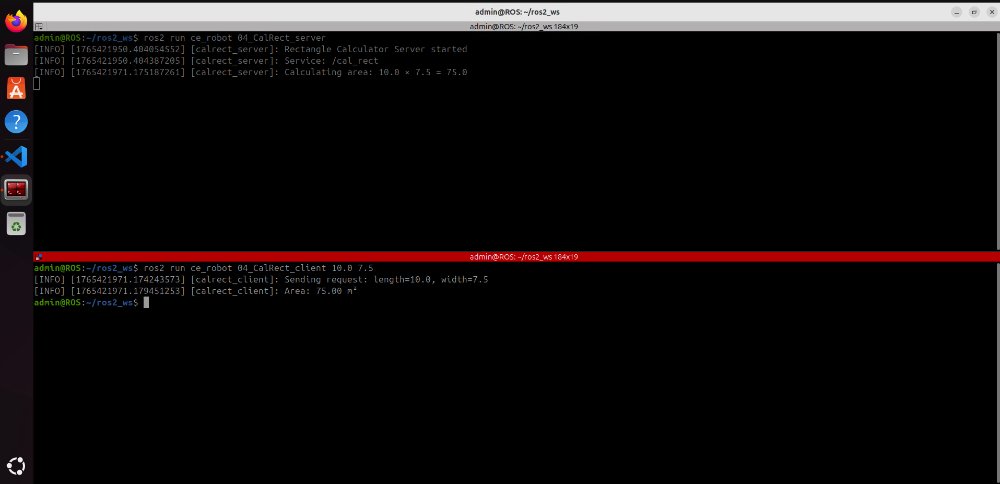

# **🔧 Custom Service (Srv) Fundamentals**

Learn how to create and use custom ROS 2 service definitions for structured request-response communication.

---

## **📌 Project Title**

Create and Use Custom Service Types in ROS 2

## **👤 Authors**

- [@alfaXphoori](https://www.github.com/alfaXphoori)

---

## **🛠 Overview**

Custom services extend ROS 2's communication capabilities by allowing you to define your own request-response structures. Unlike topics (one-way streaming), services provide synchronous communication where a client sends a request and waits for a response from a server.

**What You'll Learn:**
- Custom service definition syntax (.srv files)
- Service package structure and build configuration
- Server node implementation with request handlers
- Client node implementation with service calls
- Service type introspection and debugging

---

## **📊 Architecture Diagram**

```
┌─────────────────────────────────────────────┐
│   Client Node                               │
│  (Makes Service Requests)                   │
└──────────────┬──────────────────────────────┘
               │
         Request  │  Response
               │  │
               ▼  ▼
┌─────────────────────────────────────────────┐
│   Server Node                               │
│  (Handles Service Requests)                 │
│  - Receives request                         │
│  - Processes data                           │
│  - Returns response                         │
└─────────────────────────────────────────────┘
               │
               ▼
┌─────────────────────────────────────────────┐
│   Service Definition (.srv)                 │
│  CalRectangle                               │
│  - Request: length (float64)                │
│  - Request: width (float64)                 │
│  - Response: area_rectangle (float64)       │
└─────────────────────────────────────────────┘
```

---

## **Exercise: Rectangle Area Calculator Service**

This lab demonstrates a practical service implementation: calculating the area of a rectangle by passing length and width values.

### **Service Definition: CalRectangle.srv**

```srv
float64 length       # Rectangle length in meters
float64 width        # Rectangle width in meters
---
float64 area_rectangle  # Calculated area (length × width)
```

**Structure Breakdown:**
- **Lines 1-2:** Request fields (client sends these)
- **Line 3:** `---` separator between request and response
- **Line 4:** Response field (server returns this)

---

## **Step 1: Create Service Package**

### **1a. Create ce_robot_interfaces package (if not exists)**

```bash
cd ~/ros2_ws/src
ros2 pkg create ce_robot_interfaces
cd ce_robot_interfaces
rm -rf include/ src/
mkdir srv
```

### **1b. Create service definition file**

```bash
cd srv
touch CalRectangle.srv
```

### **1c. Edit CalRectangle.srv**

Add the following content:
```srv
float64 length
float64 width
---
float64 area_rectangle
```

### **1d. Update CMakeLists.txt**

```cmake
cmake_minimum_required(VERSION 3.8)
project(ce_robot_interfaces)

find_package(rosidl_default_generators REQUIRED)

rosidl_generate_interfaces(${PROJECT_NAME}
  "srv/CalRectangle.srv"
)

```

### **1e. Update package.xml**

```xml
<?xml version="1.0"?>
<?xml-model href="http://download.ros.org/schema/package_format3.xsd" schematypens="http://www.w3.org/2001/XMLSchema"?>
<package format="3">
  
  <build_depend>rosidl_default_generators</build_depend>
  <exec_depend>rosidl_default_runtime</exec_depend>
  <member_of_group>rosidl_interface_packages</member_of_group>

</package>
```

### **1f. Build the service package**

```bash
cd ~/ros2_ws
colcon build --packages-select ce_robot_interfaces
source install/setup.bash
```

### **1g. Verify service structure**

```bash
ros2 interface show ce_robot_interfaces/srv/CalRectangle
```

**Expected Output:**
```
float64 length
float64 width
---
float64 area_rectangle
```

---

## **Step 2: Server Implementation**

The server node listens for service requests and responds with calculated results.

### **📁 File Location**

Navigate to your ROS 2 workspace and create the Python file:

```bash
cd ~/ros2_ws/src/ce_robot/ce_robot
touch CalRect_server.py
chmod +x CalRect_server.py
```

**Directory Structure:**
```
📁 ros2_ws/
└── 📁 src/
    └── 📁 ce_robot/
        └── 📁 ce_robot/
            ├── 📄 __init__.py
            └── 🐍 CalRect_server.py    ← Create this file
```

### **File: CalRect_server.py**

```python
#!/usr/bin/env python3
"""
Service Server: Rectangle Area Calculator
Receives length and width, calculates and returns area
"""

import rclpy
from rclpy.node import Node
from ce_robot_interfaces.srv import CalRectangle


class CalRectangleServer(Node):
    def __init__(self):
        super().__init__('calrect_server')
        
        # Create service handler
        self.srv = self.create_service(
            CalRectangle,
            'cal_rect',
            self.callback_cal_rectangle
        )
        
        self.get_logger().info('Rectangle Calculator Server started')
        self.get_logger().info('Service: /cal_rect')

    def callback_cal_rectangle(self, request, response):
        """
        Handle rectangle area calculation request
        
        Args:
            request: Contains length and width
            response: Will contain calculated area
        """
        length = request.length
        width = request.width
        area = length * width
        
        response.area_rectangle = area
        
        self.get_logger().info(
            f'Calculating area: {length} × {width} = {area}'
        )
        
        return response


def main(args=None):
    rclpy.init(args=args)
    node = CalRectangleServer()
    
    try:
        rclpy.spin(node)
    except KeyboardInterrupt:
        pass
    finally:
        node.destroy_node()
        rclpy.shutdown()


if __name__ == '__main__':
    main()
```

---

## **Step 3: Client Implementation**

The client node sends service requests to the server and processes responses.

### **File: CalRect_client.py**

```python
#!/usr/bin/env python3
"""
Service Client: Rectangle Area Calculator
Sends length and width requests to server
Usage: ros2 run ce_robot cal_rect_client <length> <width>
"""

import sys
import rclpy
from rclpy.node import Node
from ce_robot_interfaces.srv import CalRectangle


class CalRectangleClient(Node):
    def __init__(self):
        super().__init__('calrect_client')

    def send_request(self, length, width):
        """Send area calculation request to server"""
        
        client = self.create_client(CalRectangle, 'cal_rect')
        
        # Wait for service to be available
        while not client.wait_for_service(timeout_sec=1.0):
            self.get_logger().info('Waiting for service...')
        
        # Create request
        request = CalRectangle.Request()
        request.length = length
        request.width = width
        
        # Send request
        self.get_logger().info(
            f'Sending request: length={length}, width={width}'
        )
        future = client.call_async(request)
        
        # Wait for response
        rclpy.spin_until_future_complete(self, future)
        
        return future.result()


def main(args=None):
    rclpy.init(args=args)
    
    # Parse command line arguments
    if len(sys.argv) != 3:
        print('Usage: cal_rect_client <length> <width>')
        print('Example: cal_rect_client 5.5 3.2')
        sys.exit(1)
    
    try:
        length = float(sys.argv[1])
        width = float(sys.argv[2])
    except ValueError:
        print('Error: length and width must be numbers')
        sys.exit(1)
    
    node = CalRectangleClient()
    response = node.send_request(length, width)
    
    node.get_logger().info(
        f'Area: {response.area_rectangle:.2f} m²'
    )
    
    node.destroy_node()
    rclpy.shutdown()


if __name__ == '__main__':
    main()
```

---

## **Step 4: Package Configuration**

### **Update setup.py**

```python
from setuptools import setup

package_name = 'ce_robot'

setup(
    name=package_name,
    version='0.0.0',
    packages=[package_name],
    data_files=[
        ('share/ament_index/resource_index/packages',
            ['resource/' + package_name]),
        ('share/' + package_name, ['package.xml']),
    ],
    install_requires=['setuptools'],
    zip_safe=True,
    maintainer='student',
    maintainer_email='student@ksu.ac.th',
    description='CE Robot ROS 2 examples',
    license='Apache License 2.0',
    tests_require=['pytest'],
    entry_points={
        'console_scripts': [
            '00_first_node = ce_robot.first_node:main',
            "01_first_pub = ce_robot.first_publisher:main",
            "01_first_sub = ce_robot.first_subscriber:main",
            "02_add_two_server = ce_robot.add_two_ints_server:main",
            "02_add_two_client = ce_robot.add_two_ints_client:main",
            "01_simple_publisher = ce_robot.simple_publisher:main",
            "01_simple_subscriber = ce_robot.simple_subscriber:main",
            "01_counter_pubslisher = ce_robot.counter_publisher:main",
            "01_counter_processor = ce_robot.counter_processor:main",
            "01_counter_logger = ce_robot.counter_logger:main",
            "01_temperature_publisher = ce_robot.temperature_publisher:main",
            "01_temperature_subsciber = ce_robot.temperature_subscriber:main",
            "01_sensor_monitor = ce_robot.sensor_monitor:main",
            "01_pressure_publisher = ce_robot.pressure_publisher:main",
            "01_humidity_publisher = ce_robot.humidity_publisher:main",
            "02_temp_converter_server = ce_robot.temp_converter_server:main",
            "02_temp_converter_client = ce_robot.temp_converter_client:main",
            "02_database_server = ce_robot.database_server:main",
            "02_database_client = ce_robot.database_client:main",
            "02_robot_controller_server = ce_robot.robot_controller_server:main",
            "02_robot_controller_client = ce_robot.robot_controller_client:main",
            "03_hw_status_publisher = ce_robot.HardwareStatus_publish:main",
            "03_hw_status_subscriber = ce_robot.HardwareStatus_subscribe:main", 
            "03_hw_status_aggregator = ce_robot.HardwareStatus_aggregate:main",
            "03_robot_status_publisher = ce_robot.RobotStatus_publisher:main",
            "03_robot_status_safety_monitor = ce_robot.RobotStatus_safety_monitor:main",
            "04_CalRect_server = ce_robot.CalRect_server:main",
            "04_CalRect_client = ce_robot.CalRect_client:main",
            "04_navigate_server = ce_robot.navigate_to_position_server:main",
            "04_navigate_client = ce_robot.navigate_to_position_client:main",
            "04_gripper_server = ce_robot.gripper_control_server:main",
            "04_gripper_client = ce_robot.gripper_control_client:main",
            "05_robot_tag = ce_robot.robot_tag_publisher:main",
            "05_robot_tag_param = ce_robot.robot_tag_param_pub:main",
            "05_robot_tag_callback = ce_robot.robot_tag_callback_pub:main",
            "05_robot_tag_validated = ce_robot.robot_tag_validated_pub:main",
            "06_count_until_server = ce_robot.count_until_server:main",
            "06_count_until_client = ce_robot.count_until_client:main",
            "06_battery_charging_server = ce_robot.battery_charging_server:main",
            "06_battery_charging_client = ce_robot.battery_charging_client:main",
            "06_navigate_server = ce_robot.navigate_server:main",
            "06_navigate_client = ce_robot.navigate_client:main",
            "06_gripper_server = ce_robot.gripper_server:main",
            "06_gripper_client = ce_robot.gripper_client:main",
        ],
    },
)
```

### **Update package.xml**

```xml
<?xml version="1.0"?>
<?xml-model href="http://download.ros.org/schema/package_format3.xsd" schematypens="http://www.w3.org/2001/XMLSchema"?>
<package format="3">

  <depend>rclpy</depend>
  <depend>ce_robot_interfaces</depend>

  <test_depend>ament_copyright</test_depend>
  <test_depend>ament_flake8</test_depend>
  <test_depend>ament_pep257</test_depend>
  <test_depend>python3-pytest</test_depend>

  <export>
    <build_type>ament_python</build_type>
  </export>
</package>
```

### **Build the package**

```bash
cd ~/ros2_ws
colcon build --packages-select ce_robot --symlink-install
source install/setup.bash
```

---

## **Step 5: Running Server and Client**

### **Start the Server**

**Terminal 1:**
```bash
ros2 run ce_robot 04_CalRect_server
```

**Expected Output:**
```
[INFO] [calrect_server]: Rectangle Calculator Server started
[INFO] [calrect_server]: Service: /cal_rect
```

### **Run the Client**

**Terminal 2:**
```bash
ros2 run ce_robot 04_CalRect_client 22.22 33.34
```

**Expected Output (Server - Terminal 1):**
```
[INFO] [calrect_server]: Rectangle Calculator Server started
[INFO] [calrect_server]: Service: /cal_rect
[INFO] [calrect_server]: Calculating area: 22.22 × 33.34 = 741.1248
```

**Expected Output (Client - Terminal 2):**
```
[INFO] [calrect_client]: Sending request: length=22.22, width=33.34
[INFO] [calrect_client]: Area: 741.12 m²
```

**Try different values:**
```bash
ros2 run ce_robot 04_CalRect_client 5.5 3.2
ros2 run ce_robot 04_CalRect_client 10.0 7.5
ros2 run ce_robot 04_CalRect_client 2.5 2.5
```

### **Example Output Screenshot**



*Figure: Rectangle Area Calculator service in action - Server (top) processing client requests (bottom)*

---

## **Service Testing & Debugging**

### **Command-line Service Call**

```bash
ros2 service call /cal_rect ce_robot_interfaces/srv/CalRectangle "{length: 5.20, width: 3.12}"
```

**Expected Output:**
```
requester: making request: CalRectangle(length=5.2, width=3.12)
response:
CalRectangle.Response(area_rectangle=16.224)
```

### **List Active Services**

```bash
ros2 service list
```

### **Check Service Type**

```bash
ros2 service type /cal_rect
```

### **View Service Definition**

```bash
ros2 interface show ce_robot_interfaces/srv/CalRectangle
```

### **View Service Information**

```bash
ros2 service info /cal_rect
```

### **Visualize Service Connections**

```bash
rqt_graph
```

---

## **📝 Key Concepts**

### **Service vs Topic**
| Aspect | Service | Topic |
|--------|---------|-------|
| **Communication** | Synchronous request-response | Asynchronous streaming |
| **Use Case** | One-time requests/responses | Continuous data flow |
| **Blocking** | Client waits for response | Non-blocking |
| **Example** | Database query, calculation | Sensor readings, state updates |

### **Service Definition Syntax**
- Request fields: Listed before `---`
- Response fields: Listed after `---`
- Field types: Same as ROS 2 message types (float64, int32, string, etc.)
- Comments: Use `#` for inline documentation

### **Error Handling**
- Use `try-except` blocks in client code
- Check service availability before calling
- Implement timeout handling for robustness
- Log errors for debugging

---

## **⚠️ Troubleshooting**

### **Issue: "Service not available"**
- **Cause:** Server node not running
- **Solution:** Start server in another terminal with `ros2 run ce_robot cal_rect_server`

### **Issue: "ModuleNotFoundError: No module named 'ce_robot_interfaces'"**
- **Cause:** Service package not built or sourced
- **Solution:** 
  ```bash
  cd ~/ros2_ws
  colcon build --packages-select ce_robot_interfaces
  source install/setup.bash
  ```

### **Issue: "Service client timed out"**
- **Cause:** Server not responding in time
- **Solution:** Check if server is still running, increase timeout value

### **Issue: "TypeError: 'Request' object is not iterable"**
- **Cause:** Incorrect request field assignment
- **Solution:** Use dot notation: `request.length = value`, not dictionary access

---

## **📚 Resources**

- [ROS 2 Services Documentation](https://docs.ros.org/en/jazzy/Concepts/Intermediate/About-Services.html)
- [ROS 2 Creating Custom Services](https://docs.ros.org/en/jazzy/Tutorials/Intermediate/Creating-Custom-Srv-Msg.html)
- [ROS 2 Service Examples](https://docs.ros.org/en/jazzy/Tutorials/Beginner-Client-Libraries/Writing-A-Simple-Service-And-Client-Python.html)
- [ROS 2 Interface Documentation](https://docs.ros.org/en/jazzy/Concepts/Intermediate/About-Interfaces.html)

---

## **✅ Verification Checklist**

- [ ] Service package created with .srv file
- [ ] CMakeLists.txt updated for service generation
- [ ] package.xml includes rosidl dependencies
- [ ] Service interface built successfully (`colcon build`)
- [ ] Server node runs without errors
- [ ] Client connects to server successfully
- [ ] Service call returns correct calculations
- [ ] Command-line service call works
- [ ] rqt_graph shows client-server connection
- [ ] All error cases handled gracefully

---

**🎓 Congratulations! You've learned ROS 2 custom services!** 🚀✨
