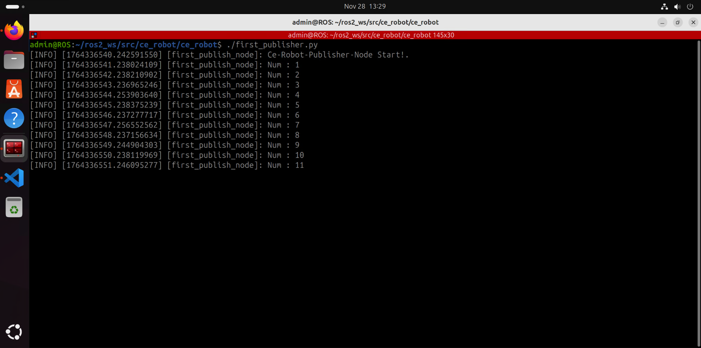
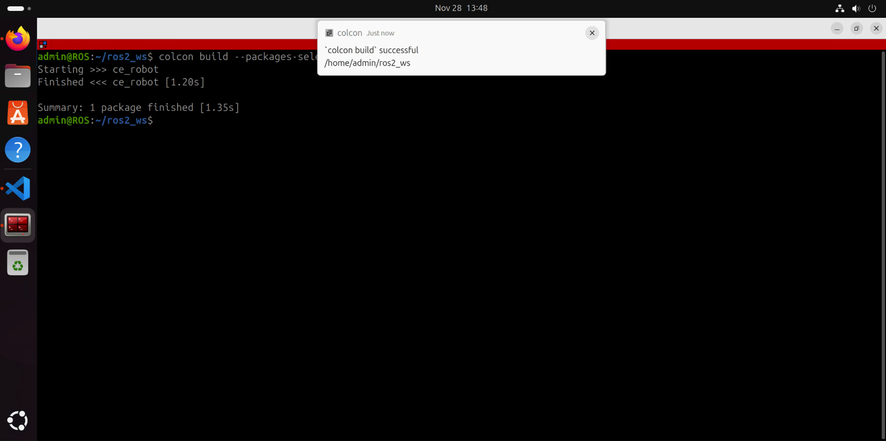
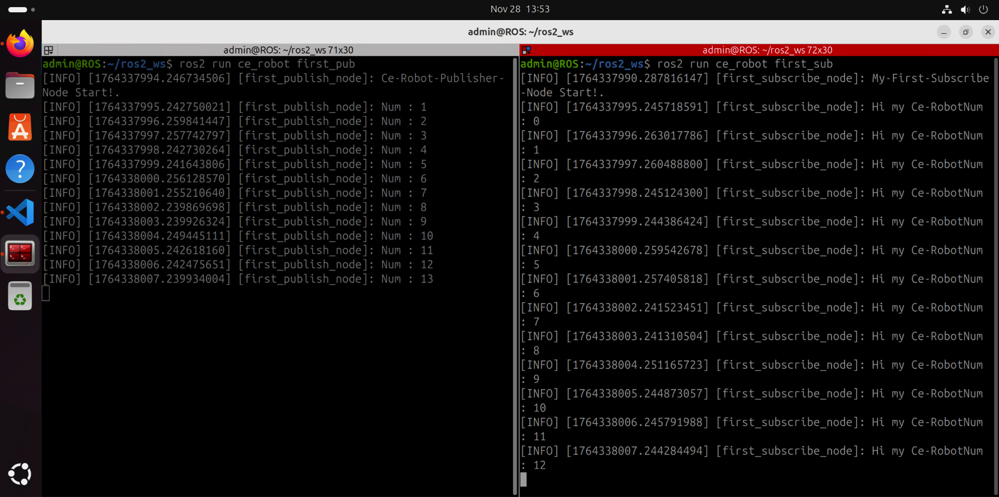

# **ROS2 Publisher & Subscriber Nodes**

## **📌 Project Title**

Create Publisher and Subscriber Nodes in ROS 2

## **👤 Authors**

- [@alfaXphoori](https://www.github.com/alfaXphoori)

## **🛠 Overview**

Setting up a **Publisher Node** involves creating a node to send data 📡, while a **Subscriber Node** listens for incoming data. This guide demonstrates the basic pub/sub pattern in ROS 2.

---

## **🛠️ Setting Up the Publisher Node**

Navigate to the `ce_robot` package directory:

```bash
cd ~/ros2_ws/src/ce_robot/ce_robot
```

Create a Python file for the Publisher:

```bash
touch first_publisher.py
chmod +x first_publisher.py
```


Write the necessary Python code and test the file using:

```bash
./first_publisher.py
```



---

## **📥 Setting Up the Subscriber Node**

Navigate to the `ce_robot` folder:

```bash
cd ~/ros2_ws/src/ce_robot/ce_robot
```

Create a Python file for the Subscriber:

```bash
touch first_subscriber.py
chmod +x first_subscriber.py
```

Write the necessary Python code and test the file using:

```bash
./first_subscriber.py
```

---

## **📌 Updating `package.xml` & `setup.py`**

1. Modify the `package.xml` file to include necessary dependencies ✏️

2. Update the `setup.py` file by adding the following lines under `console_scripts`:

   ```python
   entry_points={
       'console_scripts': [
           "first_pub = ce_robot.first_publisher:main",
           "first_sub = ce_robot.first_subscriber:main",
       ],
   },
   ```

---

## **🔨 Building the Package with Colcon**

Once the code is error-free, compile the package using `colcon build`:

```bash
cd ~/ros2_ws
colcon build --packages-select ce_robot --symlink-install
```



---

## **🚀 Running and Testing the Package**

### **Start the Publisher Node**

Open a terminal and run:

```bash
ros2 run ce_robot first_pub
```


### **Start the Subscriber Node**

Open another terminal and run:

```bash
ros2 run ce_robot first_sub
```



### **Monitor Node Connections**

To visualize the node connections, open another terminal and run:

```bash
rqt_graph
ros2 topic list
ros2 topic info /topic_name
```


---

## **📂 Directory Structure**

```
📁 ROS2_WS/
├── 📁 .vscode/
├── 📁 build/
├── 📁 install/
├── 📁 log/
└── 📁 src/
    ├── 📁 .vscode/
    └── 📁 ce_robot/
        ├── 📁 ce_robot/
        │   ├── 📄 __init__.py
        │   ├── 🐍 first_node.py
        │   ├── 🐍 first_publisher.py
        │   └── 🐍 first_subscriber.py
        ├── 📁 resource/
        │   └── 📄 ce_robot
        ├── 📁 test/
        ├── 📄 package.xml
        ├── 📄 setup.cfg
        └── 📄 setup.py
```

---

**✅ Setup Complete!** 🚀✨
