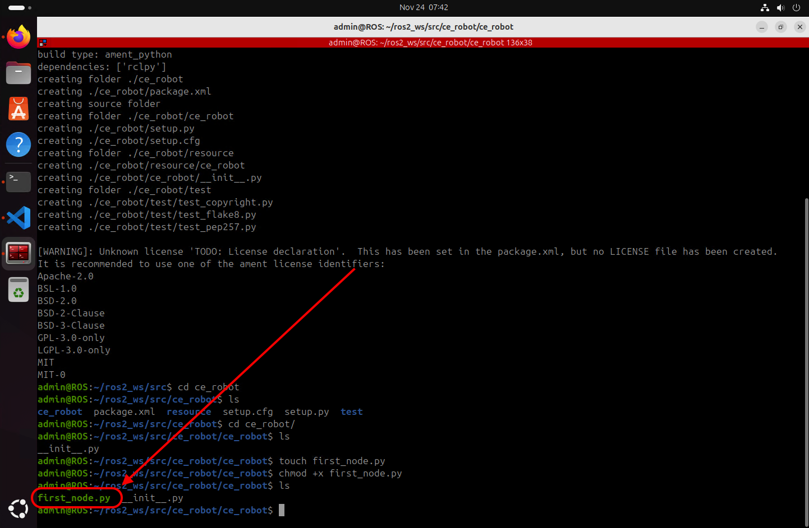

# 💻 **ROS 2 Jazzy Jalisco Installation & Setup**

## **📌 Project Title**

Complete ROS 2 Jazzy Jalisco Development Environment Setup on Ubuntu 24.04 LTS

## **👤 Authors**

- [@alfaXphoori](https://www.github.com/alfaXphoori)

---

## **📋 Overview**

This comprehensive guide covers complete setup of a professional ROS 2 development environment. You'll learn to:

- Set up a complete ROS 2 development virtual machine environment
- Install ROS 2 Jazzy Jalisco with all required dependencies
- Configure essential development tools (VS Code, Terminator)
- Build the colcon build system and configure environment variables
- Create and execute your first ROS 2 package and nodes
- Understand ROS 2 architecture and core communication patterns

This foundation enables progression through all subsequent ROS 2 learning modules covering Publisher/Subscriber, Services, Messages, Parameters, Actions, and Launch systems.

---

## **✅ Prerequisites**

- Personal computer or laptop with VirtualBox installed
- Minimum 50 GB free disk space for virtual machine
- Ubuntu 24.04 LTS ISO image downloaded
- 8GB+ RAM available (16GB+ recommended for smooth performance)
- Administrator privileges for software installation

---

## **📊 ROS 2 Architecture Diagram**

```
┌─────────────────────────────────────────────────────┐
│         Ubuntu 24.04 LTS (Virtual Machine)          │
├─────────────────────────────────────────────────────┤
│  ┌──────────────────────────────────────────────┐   │
│  │    ROS 2 Jazzy Middleware (DDS-based)        │   │
│  │  ┌───────────────────────────────────────┐   │   │
│  │  │  Node 1       Node 2       Node 3     │   │   │
│  │  │ (Publisher) (Subscriber)  (Service)   │   │   │
│  │  └───────────────────────────────────────┘   │   │
│  │  ┌───────────────────────────────────────┐   │   │
│  │  │  Topics, Services, Actions, Params    │   │   │
│  │  └───────────────────────────────────────┘   │   │
│  └──────────────────────────────────────────────┘   │
├─────────────────────────────────────────────────────┤
│  Build System: Colcon                               │
│  Package Format: ament_python                       │
│  Communication: DDS (Default Middleware)            │
├─────────────────────────────────────────────────────┤
│  Development Tools: VS Code, Terminator, Git        │
└─────────────────────────────────────────────────────┘
```

---

## **🎯 Learning Objectives**

After completing this module, you will be able to:

- [ ] Understand ROS 2 Jazzy architecture and core concepts
- [ ] Set up a virtual machine with proper resource allocation
- [ ] Install ROS 2 Jazzy Jalisco from official repositories
- [ ] Configure environment variables and shell initialization
- [ ] Install and use the Colcon build system
- [ ] Set up professional development tools (VS Code, extensions)
- [ ] Create ROS 2 packages using ament_python
- [ ] Understand ROS 2 workspace structure (src, build, install, log)
- [ ] Write and execute your first ROS 2 node in Python
- [ ] Verify ROS 2 installation with talker/listener demo
- [ ] Understand node communication through topics and pub/sub
- [ ] Navigate ROS 2 CLI tools (ros2 topic, ros2 node, rqt_graph)

---

## **🛠 Step 1: Virtual Machine Environment Setup**

ROS 2 will be installed on a **Virtual Machine** using:

- **VirtualBox** ([⬇️ Download Link](https://www.virtualbox.org/wiki/Downloads))
- **Ubuntu 24.04 LTS** ([⬇️ Download Link](https://ubuntu.com/download/desktop))

### **1.1 Create and Configure Virtual Machine**

1. **Create a New Virtual Machine**

   Open VirtualBox and click on **New** to create a new virtual machine.
   

2. **Configure Virtual Machine Name and OS**

   - Set the VM Name (e.g., `ROS`)
   - Select the Ubuntu ISO image
   - Choose OS: Linux, Distribution: Ubuntu (64-bit)
   - Check "Proceed with Unattended Installation"

   

3. **Set Up Unattended Installation**

   - User Name: `admin`
   - Password: Set your password
   - Hostname: `ROS`
   - Domain Name: `myguest.virtualbox.org`
   - Install Guest Additions (recommended)

   

4. **Specify Virtual Hardware**

   - Base Memory: 8192 MB (recommended)
   - Number of CPUs: 10 (adjust based on your system)
   - Enable EFI (optional)

   

5. **Specify Virtual Hard Disk**

   - Create a New Virtual Hard Disk
   - Disk Size: 50 GB (recommended minimum)
   - Hard Disk File Type: VDI (VirtualBox Disk Image)

   

6. **Finish and Start**

   Click **Finish** to create the virtual machine, then click **Start** to begin the Ubuntu installation.

---

## **🚀 Step 2: Install ROS 2 Jazzy Jalisco**

### **2.1 Install ROS 2 from Official Repositories**

Follow the official installation guide:
[ROS 2 Jazzy Installation](https://docs.ros.org/en/jazzy/Installation/Ubuntu-Install-Debs.html)

To locate `.bashrc`, use:

```bash
ls -a
```


Open `.bashrc` with Nano:

```bash
nano ~/.bashrc
```

Append this line to the end of the file:

```bash
source /opt/ros/jazzy/setup.bash
```

Reload the terminal and verify the installation:

```bash
ros2
```

**✅ Congratulations! ROS 2 has been successfully installed.**


---

## **🛠 Step 3: Install and Configure Build System**

### **3.1 Install Colcon Build System**

1. Verify ROS 2 installation:

   ```bash
   source /opt/ros/jazzy/setup.bash
   ```

2. Install Colcon:

   ```bash
   sudo apt install python3-colcon-common-extensions
   ```

   

3. Verify installation:

   ```bash
   cd /usr/share/colcon_argcomplete/hook/ && ls
   ```

4. Update `.bashrc` with:

   ```bash
   nano ~/.bashrc
   ```

   Add these lines at the end:

   ```bash
   source /opt/ros/jazzy/setup.bash
   source /usr/share/colcon_argcomplete/hook/colcon-argcomplete.bash
   source ~/ros2_ws/install/setup.bash
   ```

   


---

## **💻 Step 4: Configure Development Tools**

### **4.1 Install Visual Studio Code**

Install **VS Code** on Ubuntu for easier development.

### **Installation Methods**

```bash
sudo snap install --classic code
```

Launch VS Code:

```bash
code
```

### **Recommended Extensions**

**Microsoft & Official Extensions:**
- C/C++
- C/C++ Extension Pack
- Python
- CMake
- CMake Tools
- XML
- XML Tools
- Robot Developer Extensions for ROS 2

**AI & Development Tools:**
- Windsurf (Codeium) - Advanced AI-powered code assistant with AI Composer for multi-file editing
- GitHub Copilot - Intelligent code completion and generation


### **Installing Windsurf Extension**

1. Open VS Code and go to **Extensions** (Ctrl+Shift+X / Cmd+Shift+X)
2. Search for **"Windsurf"** or **"Codeium"**
3. Click **Install** on the Windsurf extension
4. Sign in with your Codeium account (free tier available)
5. Verify installation by checking the Windsurf icon in the activity bar

**Windsurf Features:**
- AI Composer for multi-file code generation
- Intelligent code suggestions and completions
- Context-aware refactoring assistance
- Multi-file editing capabilities
- Perfect for accelerating ROS 2 development with AI support

---

### **4.2 Install Terminator Terminal Emulator**

Install **Terminator** for better terminal management with split panes:

```bash
sudo apt update
sudo apt install terminator
```

Launch Terminator:

```bash
terminator
```


---

### **4.3 Install Essential Development Tools**

Install commonly used development tools and utilities:

```bash
sudo apt update
sudo apt install build-essential git curl wget vim
```

### **Install Python3-PIP for Package Building**

```bash
sudo apt install python3-pip
```

---

## **✅ Step 5: Create First Package and Verify Installation**

### **5.1 Demo Run: ROS 2 Talker & Listener**

Run a simple talker-listener test.

### **Start a Listener Node**

```bash
ros2 run demo_nodes_py listener
```

### **Start a Talker Node** (In a new terminal)

```bash
ros2 run demo_nodes_py talker
```

### **5.2 Monitor ROS 2 Topics and Nodes**

```bash
rqt_graph
ros2 topic list
ros2 topic info /chatter
ros2 topic info /chatter --verbose
```


---

## **5.3 Create Your First ROS 2 Package**

Follow these steps to build your first ROS 2 package:

**1. Create a workspace and build it:**

   ```bash
   mkdir -p ~/ros2_ws/src
   cd ~/ros2_ws
   colcon build
   ```

   

**2. Create a new package named `ce_robot`:**

   ```bash
   cd src
   ros2 pkg create ce_robot --build-type ament_python --dependencies rclpy
   ```

   

**3. Navigate to the package directory:**

   ```bash
   cd ce_robot/ce_robot
   ```

**4. Create a Python node and make it executable:**

   ```bash
   touch first_node.py
   chmod +x first_node.py
   ```

   

**5. Write the Python code for the node, then run it:**

   ```bash
   cd ~/ros2_ws
   code .
   ```

   

**6. Modify `package.xml` and `setup.py` to include the node:**
   - In `setup.py`, under `console_scripts`:

     ```bash
     'first_node = ce_robot.first_node:main',
     ```

   

**7. Build the package:**

   ```bash
   cd ~/ros2_ws
   colcon build
   ```

**8. Run the ROS 2 node:**

   ```bash
   source ~/.bashrc
   ros2 run ce_robot first_node
   ```

   

**✅ You have successfully created and executed your first ROS 2 package!**

---

## **📝 Key Concepts**

### **ROS 2 Communication Patterns**

| Communication Pattern | Use Case | Sync/Async | One-to-Many |
|----------------------|----------|-----------|------------|
| **Topics (Pub/Sub)** | Continuous sensor data, real-time streaming | Async | ✅ Yes |
| **Services** | Request-response, synchronous operations | Sync | ❌ No |
| **Actions** | Long-running tasks with feedback | Async | ❌ No |
| **Parameters** | Runtime configuration, dynamic settings | N/A | ✅ Yes |

### **ROS 2 Ecosystem Components**
- **ROS 2 (Robot Operating System 2)** - Middleware framework for robotics with DDS-based communication
- **Jazzy Jalisco** - Long-term support (LTS) release with extended maintenance window
- **Ubuntu 24.04 LTS** - Stable base operating system with 5 years of support
- **Colcon** - Build tool designed specifically for ROS 2 projects with parallel compilation
- **rclpy** - Python client library providing intuitive API for ROS 2 functionality

### **Important Directories**
- `~/ros2_ws/` - ROS 2 workspace (user packages here)
- `~/ros2_ws/src/` - Source code directory for all packages
- `/opt/ros/jazzy/` - ROS 2 installation directory
- `~/.bashrc` - Shell configuration file (auto-sourced at login)

### **Core ROS 2 Concepts**
- **Nodes** - Individual programs/processes that perform specific tasks
- **Topics** - Asynchronous communication channels for publishers and subscribers
- **Services** - Synchronous request-reply communication pattern
- **Actions** - Long-running asynchronous tasks with feedback and cancellation
- **Messages** - Data structures defining topic communication format
- **Parameters** - Runtime configuration values accessible to all nodes
- **Middleware** - DDS (Data Distribution Service) handles all inter-process communication

---

## **📂 Directory Structure**

```
📁 ROS2_WS/
├── 📁 .vscode/
├── 📁 build/
├── 📁 install/
├── 📁 log/
└── 📁 src/
    ├── 📁 .vscode/
    └── 📁 ce_robot/
        ├── 📁 ce_robot/
        │   ├── 📄 __init__.py
        │   └── 🐍 first_node.py
        ├── 📁 resource/
        │   └── 📄 ce_robot
        ├── 📁 test/
        ├── 📄 package.xml
        ├── 📄 setup.cfg
        ├── 📄 setup.py
```

---

## **🚀 Next Steps**

After completing the installation, explore these topics:

1. **Publisher & Subscriber** - Send and receive data between nodes
2. **Services & Clients** - Request-reply communication pattern
3. **Custom Messages** - Define your own data structures
4. **Launch Files** - Automate running multiple nodes
5. **Parameters** - Dynamic configuration management

---

## **⚠️ Troubleshooting**

### **Issue: Command `ros2` not found**
**Cause:** ROS 2 environment not sourced in current terminal
**Solution:**
```bash
source /opt/ros/jazzy/setup.bash
```
**Prevention:** Add the line above to `~/.bashrc` to auto-source on login

### **Issue: Colcon build fails with dependency errors**
**Cause:** Missing Python dependencies or corrupt build cache
**Solution:**
```bash
cd ~/ros2_ws
rm -rf build install log
colcon build --symlink-install
```
**Prevention:** Always run `rosdep install` before building new packages

### **Issue: Permission denied on .py files**
**Cause:** Python files don't have execute permissions
**Solution:**
```bash
chmod +x ~/ros2_ws/src/ce_robot/ce_robot/*.py
```
**Prevention:** Use `chmod +x` when creating new executable Python scripts

### **Issue: Python package `rclpy` not found**
**Cause:** ROS 2 libraries not in Python path or environment not activated
**Solution:**
```bash
pip3 install rclpy
source ~/.bashrc
```
**Prevention:** Always source setup.bash before running Python scripts

---

## **📚 Resources**

- [ROS 2 Official Documentation](https://docs.ros.org/) - Complete official documentation
- [ROS 2 Jazzy Tutorials](https://docs.ros.org/en/jazzy/Tutorials.html) - Step-by-step tutorials
- [ROS 2 Community Forum](https://discourse.ros.org/) - Community support and discussions
- [ROS 2 GitHub Repository](https://github.com/ros2) - Official source code
- [Colcon Build System Guide](https://colcon.readthedocs.io/) - Build system documentation

---

## **✅ Verification Checklist**

Installation and setup are complete when you can verify:

- [ ] Ubuntu 24.04 LTS installed on VM with proper resource allocation
- [ ] ROS 2 Jazzy installed successfully (`ros2 --version` shows version info)
- [ ] `.bashrc` configured with ROS 2 setup sourcing
- [ ] Colcon build system installed and functional
- [ ] VS Code installed with ROS extensions activated
- [ ] Terminator terminal emulator installed and working
- [ ] First ROS 2 package `ce_robot` created in workspace
- [ ] First node `first_node.py` created and executable
- [ ] Demo talker-listener test runs without errors
- [ ] `rqt_graph` visualization displays topic connections
- [ ] All environment variables properly set (`ros2 env` works)

---

## **🚀 Next Steps**

After completing this installation module, proceed with:

1. **01_Publisher_Subscriber** - Learn asynchronous one-to-many messaging patterns with topics
   - Create publishers that broadcast data continuously
   - Create subscribers that listen to topic data
   - Master QoS (Quality of Service) settings for reliable communication

2. **02_Server_Client** - Master synchronous request-response communication
   - Implement services for request-reply operations
   - Build clients that send requests and wait for responses
   - Understand blocking vs non-blocking service calls

3. **03_Message** - Define custom message types for domain-specific data
   - Create custom ROS 2 message definitions
   - Understand message serialization and data types
   - Extend publisher/subscriber to use custom messages

---

**✅ Installation Complete! Ready to start your ROS 2 learning journey!** 🚀✨
