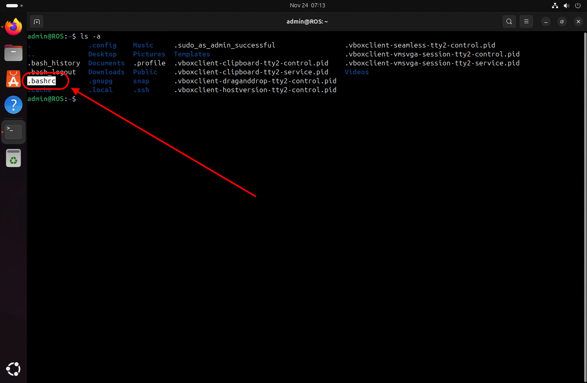
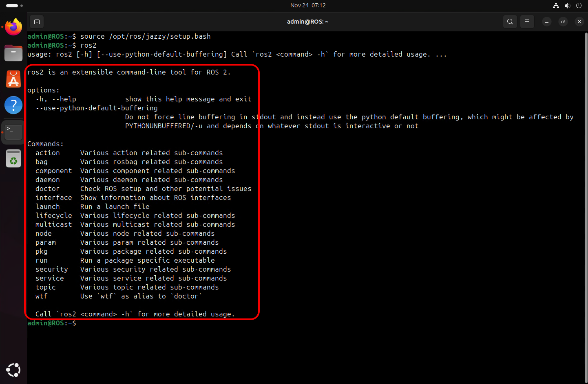
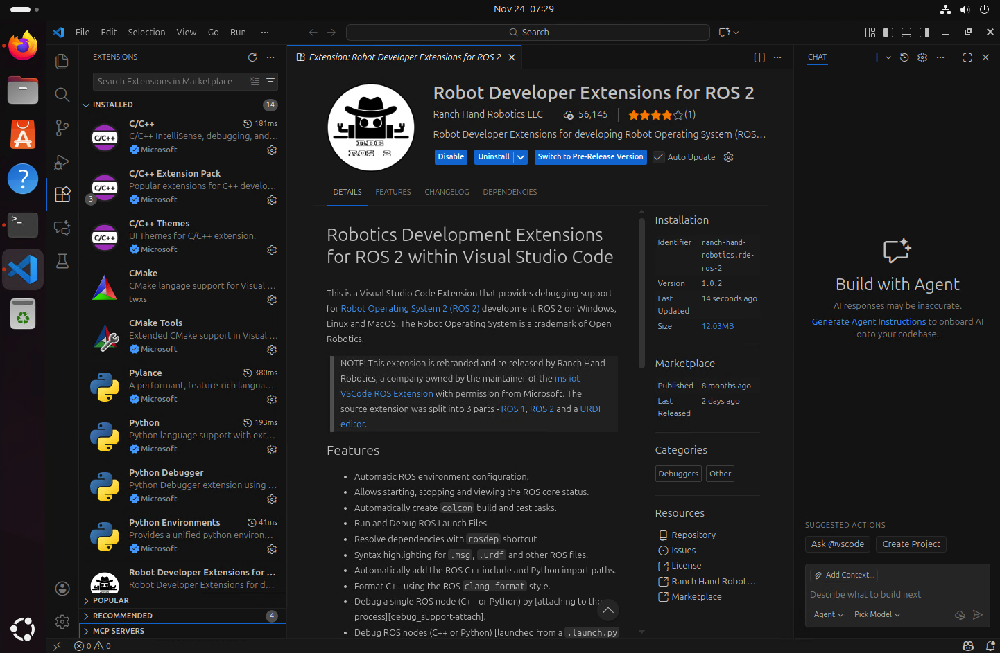
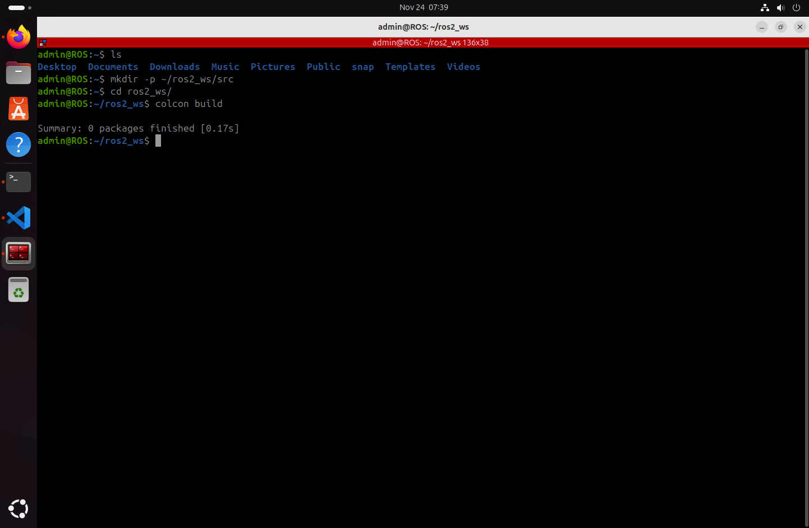
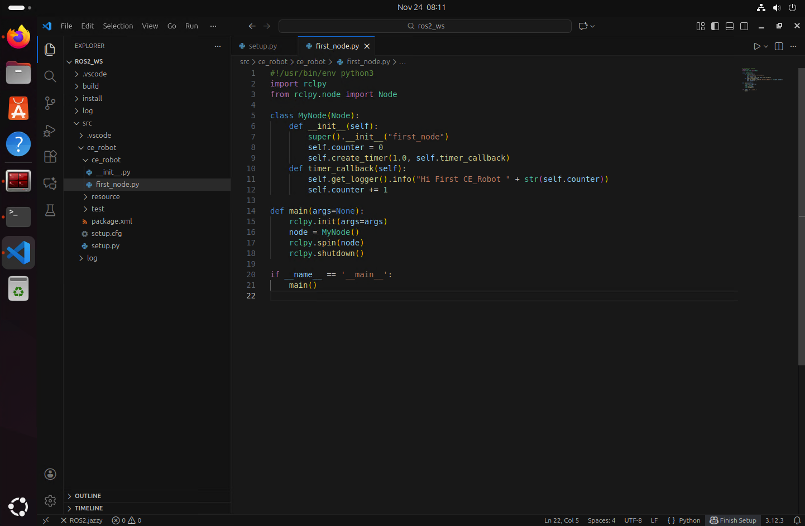
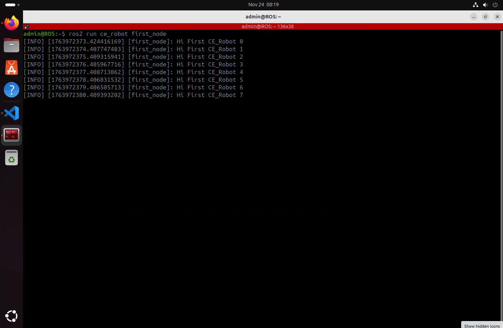

# **ROS2 Jazzy Jalisco / Ubuntu 24.04**

## **📌 Project Title**

ROS2 Jazzy Jalisco on Ubuntu 24.04

## **👤 Authors**

- [@alfaXphoori](https://www.github.com/alfaXphoori)

## **🛠 Environment Setup**

ROS 2 will be installed on a **Virtual Machine** using:

- **VirtualBox** - ([⬇️ Link](https://www.virtualbox.org/wiki/Downloads))
- **Ubuntu 24.04 LTS** ([⬇️ Link](https://ubuntu.com/download/desktop))

## **🚀 ROS 2 Installation**

### **Step 1: Install ROS 2 Jazzy**

Follow the official installation guide:
[ROS 2 Jazzy Installation](https://docs.ros.org/en/jazzy/Installation/Ubuntu-Install-Debs.html)

To locate `.bashrc`, use:

```bash
ls -a
```



Open `.bashrc` with Nano:

```bash
nano ~/.bashrc
```

Append this line to the end of the file:

```bash
source /opt/ros/jazzy/setup.bash
```

Reload the terminal and verify the installation:

```bash
ros2
```

**✅ Congratulations! ROS 2 has been successfully installed.**



---

## **🛠 Install Colcon (ROS 2 Build System)**

1. Verify ROS 2 installation:

   ```bash
   source /opt/ros/jazzy/setup.bash
   ```

2. Install Colcon:

   ```bash
   sudo apt install python3-colcon-common-extensions
   ```

   

3. Verify installation:

   ```bash
   cd /usr/share/colcon_argcomplete/hook/ && ls
   ```

4. Update `.bashrc` with:

   ```bash
   nano ~/.bashrc
   ```

   Add these lines at the end:

   ```bash
   source /opt/ros/jazzy/setup.bash
   source /usr/share/colcon_argcomplete/hook/colcon-argcomplete.bash
   source ~/ros2_ws/install/setup.bash
   ```

   


---

## **🖥 Install Visual Studio Code (VS Code)**

Install **VS Code** on Ubuntu for easier development.

### **Installation Methods**

```bash
sudo snap install --classic code
```

Launch VS Code:

```bash
code
```

### **Recommended Extensions (Microsoft)**

- C/C++
- C/C++ Extension Pack
- Python
- CMake
- CMake Tools
- XML
- XML Tools
- Robot Developer Extensions for ROS 2



---

## **📟 Install Terminator (Advanced Terminal Emulator)**

Install **Terminator** for better terminal management with split panes:

```bash
sudo apt update
sudo apt install terminator
```

Launch Terminator:

```bash
terminator
```


---

## **💻 Essential Development Tools**

Install commonly used development tools and utilities:

```bash
sudo apt update
sudo apt install build-essential git curl wget vim
```

### **Install Python3-PIP for Package Building**

```bash
sudo apt install python3-pip
```

---

## **🎯 Demo Run: ROS 2 Talker & Listener**

Run a simple talker-listener test.

### **Start a Listener Node**

```bash
ros2 run demo_nodes_py listener
```

### **Start a Talker Node** (In a new terminal)

```bash
ros2 run demo_nodes_py talker
```

### **Monitor ROS 2 Topics**

```bash
rqt_graph
ros2 topic list
ros2 topic info /chatter
ros2 topic info /chatter --verbose
```


---

## **📦 Create Your First ROS 2 Package**

1. Create a workspace and build it:

   ```bash
   mkdir -p ~/ros2_ws/src
   cd ~/ros2_ws
   colcon build
   ```

   

2. Create a new package named `ce_robot`:

   ```bash
   cd src
   ros2 pkg create ce_robot --build-type ament_python --dependencies rclpy
   ```

   

3. Navigate to the package directory:

   ```bash
   cd ce_robot/ce_robot
   ```

4. Create a Python node and make it executable:

   ```bash
   touch first_node.py
   chmod +x first_node.py
   ```

   

5. Write the Python code for the node, then run it:

   ```bash
   cd ~/ros2_ws
   code .
   ```

   

6. Modify `package.xml` and `setup.py` to include the node:
   - In `setup.py`, under `console_scripts`:

     ```bash
     'first_node = ce_robot.first_node:main',
     ```

   

7. Build the package:

   ```bash
   cd ~/ros2_ws
   colcon build
   ```

8. Run the ROS 2 node:

   ```bash
   source ~/.bashrc
   ros2 run ce_robot first_node
   ```

   

**✅ You have successfully created and executed your first ROS 2 package!**

---

## **📂 Directory Structure**

```
📁 ROS2_WS/
├── 📁 .vscode/
├── 📁 build/
├── 📁 install/
├── 📁 log/
└── 📁 src/
    ├── 📁 .vscode/
    └── 📁 ce_robot/
        ├── 📁 ce_robot/
        │   ├── 📄 __init__.py
        │   └── 🐍 first_node.py
        ├── 📁 resource/
        │   └── 📄 ce_robot
        ├── 📁 test/
        ├── 📄 package.xml
        ├── 📄 setup.cfg
        └── 📄 setup.py
```
