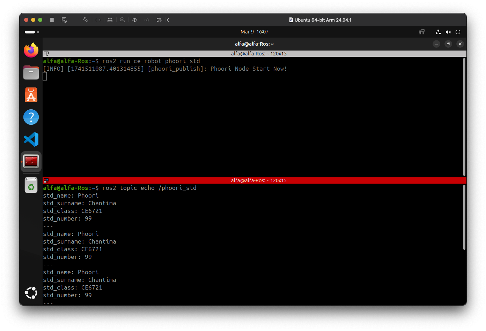
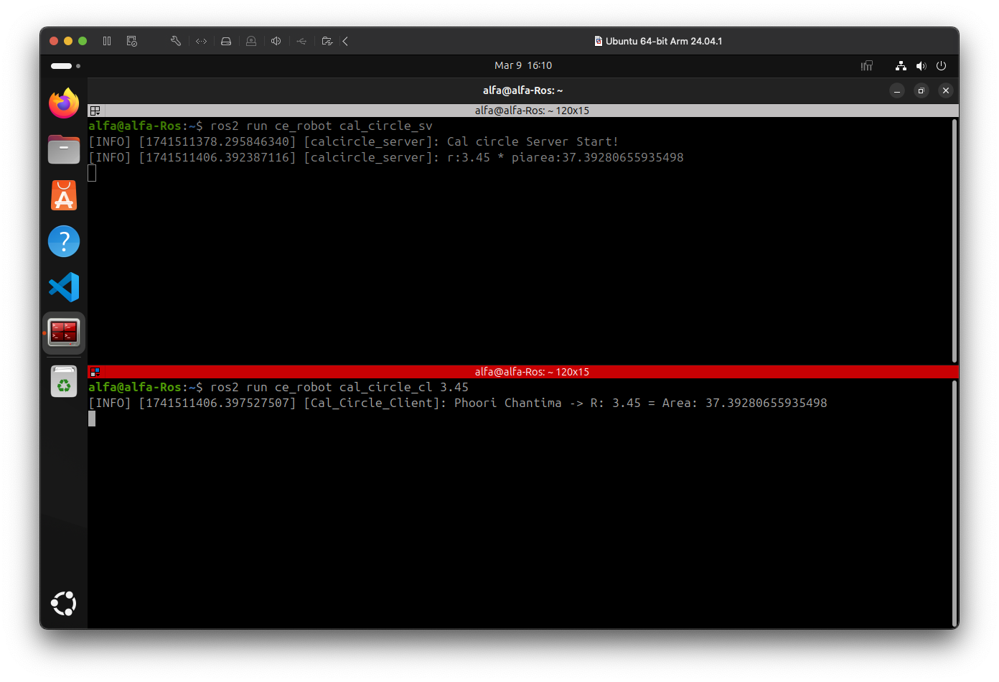
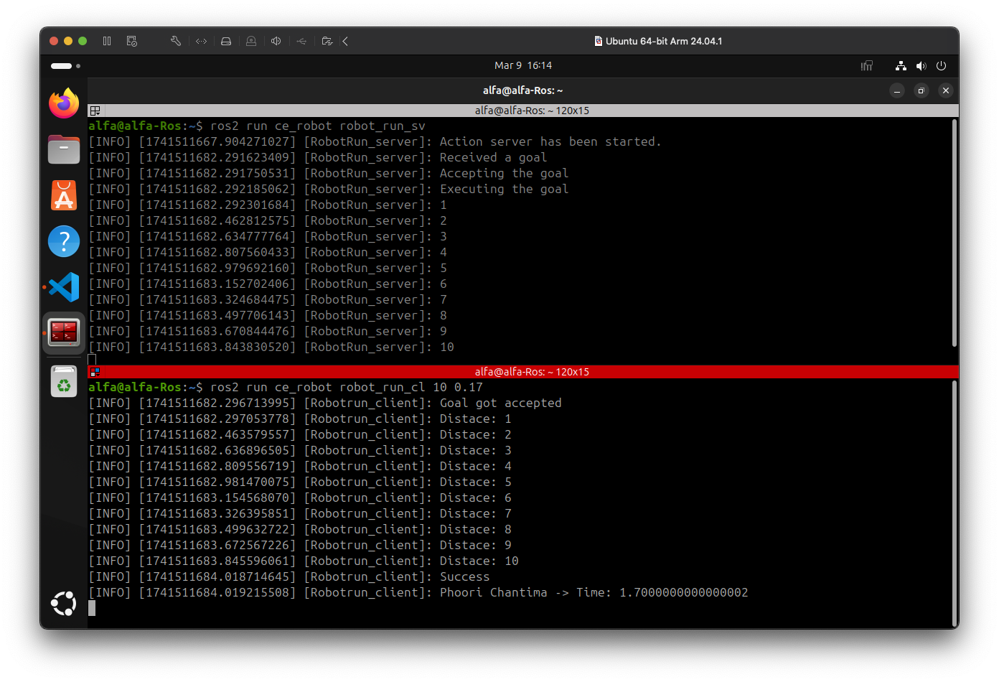

# 🚀 ข้อสอบปฏิบัติรายวิชาวิศวกรรมหุ่นยนต์เบื้องต้น 🤖

## 📌 คำชี้แจง

- ✅ ให้นักศึกษาดำเนินการเขียนโค้ดและทดสอบตามหัวข้อที่กำหนด
- 💻 สามารถใช้ภาษา **Python หรือ C++** ได้ตามต้องการ
- 📜 ให้แนบ **โค้ดที่เขียนและผลลัพธ์ที่ได้** จากการทดสอบ

---

## 🟢 1. Publisher Node & Message

### 📝 1.1 การสร้างและแก้ไข Message

📌 เพิ่มตัวแปร Message ใน **HardwareStatus.msg** ดังต่อไปนี้  

```plaintext
string std_name
string std_surname
string std_class
int64 std_number
```

### 🏗 1.2 การสร้าง Publisher Node

🖥 ให้เขียน Publisher Node ที่ทำหน้าที่ **ส่งข้อมูล HardwareStatus.msg** ออกทาง Topic  
📌 กำหนดค่าเริ่มต้นของตัวแปรดังนี้  

```python
std_name = "ชื่อของนักศึกษา"
std_surname = "นามสกุลของนักศึกษา"
std_class = "ห้องเรียนของนักศึกษา"
std_number = "รหัสนักศึกษา"
```

### ✅ 1.3 การทดสอบ

🔍 ทดสอบ Publisher Node ที่สร้างขึ้นด้วยคำสั่ง  
*** phoori_std คืือ topic

```sh
ros2 topic echo /phoori_std
```
📌 แสดงผลลัพธ์  
- 
---

## 🔵 2. Service (พื้นที่วงกลม)

### 📝 2.1 การสร้าง Service Server

📂 ให้สร้างไฟล์ **CircleArea.srv** ภายใน package ของตนเอง  
📌 กำหนดโครงสร้างของ Service ดังนี้  

```plaintext
# Request
float64 r
---
# Response
float64 area
```

### 🏗 2.2 การสร้าง Service Server & Client

📌 ให้สร้าง Service Server ที่รับค่ารัศมี
และคำนวณพื้นที่ของวงกลมจากสูตร  

```
area = π * r^2
```

📌 ให้ส่งค่ากลับไปยัง Client พร้อมกับ **ชื่อนักศึกษา**

### ✅ 2.3 การทดสอบ

🔍 ทดสอบ Service Server โดยใช้คำสั่ง  

```sh
ros2 run ce_robot 
```
📌 แสดงผลลัพธ์  
- 
---

## 🟠 3. Action (Robot Run)

### 📝 3.1 การสร้าง Action Definition File

📂 ให้สร้างไฟล์ **RobotRun.action** ภายใน package ของตนเอง  
📌 กำหนดโครงสร้างของ Action ดังนี้  

```plaintext
# Goal
int64 target_distance
float speed
---
# Result
int64 time
---
# Feedback
int64 current_distance
```

### 🏗 3.2 การสร้าง Action Server

📌 ให้เขียน Action Server ที่  

- รับค่า **target_distance** และ **speed**  
- คำนวณเวลาในการเคลื่อนที่จากสูตร  

  ```
  time = target_distance / speed
  ```

- ส่งค่าผลลัพธ์กลับไปยัง Client  
- อัปเดตค่าของ **current_distance** เป็นระยะที่เคลื่อนที่ไป  

### 📡 3.3 การสร้าง Action Client

📌 ให้เขียน Action Client ที่  

- ส่งค่า **target_distance** และ **speed** ไปยัง Server  
- รับค่าผลลัพธ์ที่ได้จาก Server 

### ✅ 3.4 การทดสอบ

🔍 ทดสอบการทำงานของ Action Sever & Action Client โดยใช้คำสั่ง  

```sh
ros2 run ce_robot robot_
```
📌 แสดงผลลัพธ์  
- 
---

## ✅ จบข้อสอบ  
